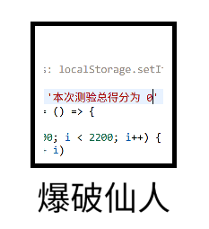
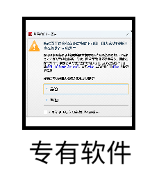
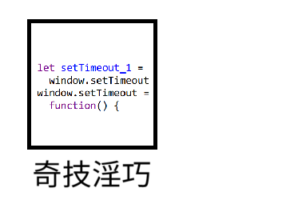
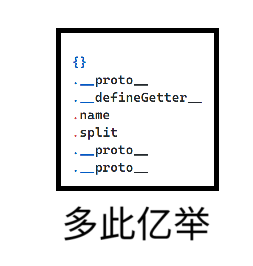
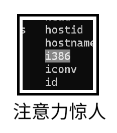
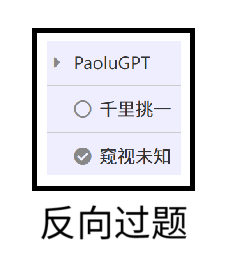
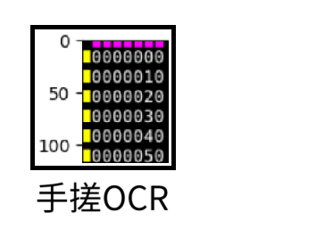
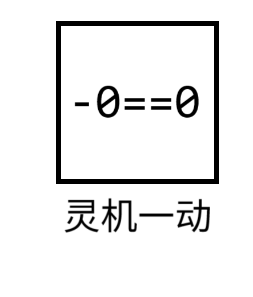
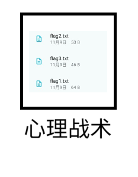
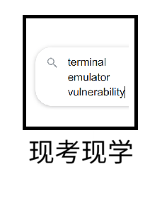

# HackerGame 2024 个人题解

> Author: yezhiyi9670 #/runle timer 0 (2802)
>
> [查看原仓库](https://github.com/yezhiyi9670/hackergame-2024-personal-writeup)
>
> [比赛平台](https://hack.lug.ustc.edu.cn/) · [排行榜存档](https://hg2024.lug.ustc.edu.cn/) · [官方题解仓库与题目源代码存档](https://github.com/USTC-Hackergame/hackergame2024-writeups)

这是我的 [USTC HackerGame](https://hack.lug.ustc.edu.cn/) 2024 个人题解。此题解旨在详细记录我的思考/尝试过程。

我的主操作系统是 Windows。涉及需要 GNU/Linux 的操作时，在 Docker 容器内进行。

此仓库在比赛期间建立并有过数次 commit（目的是备份数据），但是在比赛结束前并没有公开。

## 0. 目录

点击题目名称访问题目的题解内容。带有 `*` 的题解**包含官方题解最初发布时没有提到的非预期解**。

|#|分类|个人技能|题目|子任务|完成时间|
|-|-|-|-|-|-|
|1|web|trivial|[签到](part-1/README.md#1-签到)||2-14:54
|2|web|search|[喜欢做签到的 CTFer 你们好呀](./part-1/README.md#2-喜欢做签到的-ctfer-你们好呀)||2-15:55|
|3|general|search|[猫咪问答](./part-1/README.md#3-猫咪问答)|2/2|2-17:20|
|4|general|trivial|[打不开的盒](./part-1/README.md#4-打不开的盒)||2-17:45|
|5|general|infer|[每日论文太多了！](./part-1/README.md#5-每日论文太多了)||2-17:40|
|6|web|frontend|[比大小王](./part-1/README.md#6-比大小王)||2-17:52|
|7|general|search|[旅行照片 4.0](./part-1/README.md#7-旅行照片-40)|3/3|2-19:54|
|8|general|trytry|[不宽的宽字符](./part-2/README.md#8-不宽的宽字符)||3-16:24|
|9|general|trytry|[**PowerfulShell**](./part-2/README.md#9-powerfulshell)\*||3-19:20|
|10|web|xp|[Node.js is Web Scale](./part-2/README.md#10-nodejs-is-web-scale)||4-21:23|
|11|web|backend|[PaoluGPT](./part-2/README.md#11-paolugpt)|2/2|3-21:46|
|12|math|~~xp~~|[~~强大的正则表达式~~](./part-2/README.md#12-强大的正则表达式)|1/3|3-21:52|
|13|math|~~trivial~~|[~~惜字如金 3.0~~](./part-2/README.md#13-惜字如金-30)|1/3|3-22:06|
|14|math|trytry|[**优雅的不等式**](./part-2/README.md#14-优雅的不等式)\*|2/2|6-15:23|
|15|general|automate|[**无法获得的秘密**](./part-3/README.md#15-无法获得的秘密)\*||5-15:41|
|16|general|trytry|[**Docker for Everyone Plus**](./part-3/README.md#16-docker-for-everyone-plus)\*|2/2|4-16:06|
|17|general|xp|[看不见的彼方：交换空间](./part-3/README.md#17-看不见的彼方-交换空间)|2/2|4-01:59|
|20|general|search|[不太分布式的软总线](./part-3/README.md#20-不太分布式的软总线)|3/3|7-01:21|
|22|general|search|[动画分享](./part-3/README.md#22-动画分享)|2/2|4-19:37|
|24|math|~~math~~|[~~关灯~~](./part-3/README.md#24-关灯)|3/4|6-01:48|
|25|web|backend|[禁止内卷](./part-3/README.md#25-禁止内卷)||4-17:31|
|26|binary|~~reverse~~|[~~哈希三碰撞~~](./part-3/README.md#26-哈希三碰撞)|1/3|6-13:51|
|27|math|~~search~~|[~~零知识数独~~](./part-3/README.md#27-零知识数独)|2/3|6-10:45|
|34|AI|~~trivial~~|[~~[redacted]~~](./part-3/README.md#34-redacted)|1/2|5-02:22|

鉴于题目的 flag 往往有调侃、提示、启示等作用，每个题解都会包含我在题目中获得的 flag 以供参考。注意实际情况下，不同选手获得的 flag 可能有所不同。

个人技能：

- `trivial` 初学者应当知道的简单小技巧
- `infer` 揣测出题意图
- `search` 通过网络搜索获取信息
- `frontend` Web 前端相关问题（脚本、修改前端行为、伪造请求、XSS 攻击等）
- `backend` Web 后端相关问题
- `xp` 需要一定的折腾或专业学习经验
- `automate` 题目本身可以手动完成（不论耗时），但需要自动化以减小工作量
- `trytry` 多试试
- `math` 数学，字面意思
- `reverse` 逆向工程

个人分类仅代表个人水平条件下的个人做法所涉及的核心难点，不表征题目的特性。
