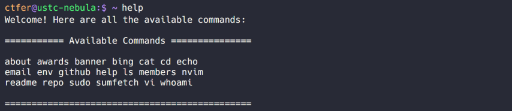
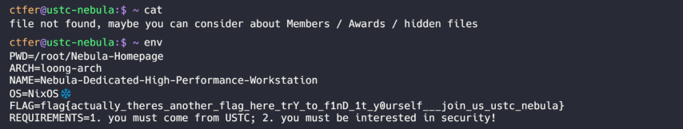
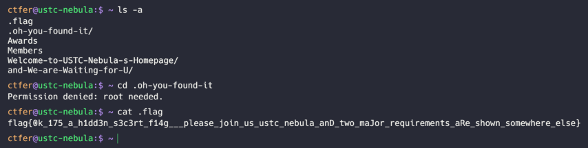
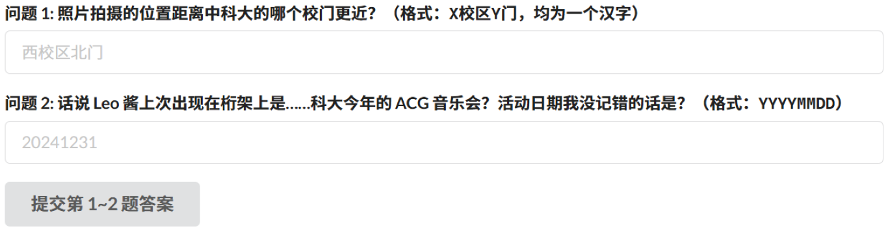
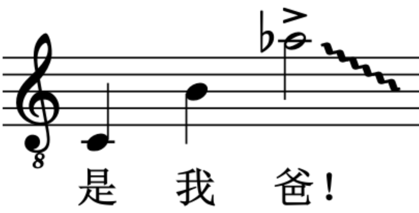

# 个人题解 第一部分

## 1. 签到

让我们说……各种语言，开始今年的冒险！


### 做法

不多说了，改 URL `/?pass=false` → `/?pass=true`。

### Flag

```plain
flag{WE!com3-70-H@CKEr94Me-aND-enJoy-HaCkiNG-2oz4}
```

Welcome to Hackergame and enjoy hacking - 2024.

## 2. 喜欢做签到的 CTFer 你们好呀


喜欢做签到的 CTFer 你们好呀，我是一道更**典型**的 checkin：有两个 flag 就藏在中国科学技术大学校内 CTF 战队的招新主页里！

### 做法

众所周知这个战队是 USTC-NEBULA，其[招新信息每年都会放到 GitHub 上](https://github.com/Nebula-CTFTeam/Recruitment-2024)。

但是在仓库里搜索并不能找到什么 flag。或许主页指的不是这个。我们查看一下 Nebula-CTFTeam 的 GitHub 团队主页，

> We are [Nebula](https://nebuu.la/).

这里有个网站，打开是一个模拟终端界面。看起来会有好玩的东西。


先 `help` 一下，



一圈试下来，这两个命令输出了有点用的信息。



其中有一个 flag 和一个提示：试试隐藏文件。



另一个也有了。

松开鼠标会导致文本选择消失，不太好复制。但是众所周知别松开鼠标，直接用 Ctrl-C 复制就行了。

### Flags

```plain
flag{actually_theres_another_flag_here_trY_to_f1nD_1t_y0urself___join_us_ustc_nebula}
flag{0k_175_a_h1dd3n_s3c3rt_f14g___please_join_us_ustc_nebula_anD_two_maJor_requirements_aRe_shown_somewhere_else}
```

Actually there's another flag here. Try to find it yourself. | join us ustc-nebula

Ok, it's a hidden secret flag | please join us ustc-nebula and two major requirements are shown somewhere else.

## 3. 猫咪问答


### 做法

#### 问题 1 - HackerGame 2015 赛前讲座

第一题问的是 HackerGame 2015 动员会在哪开。GitHub 上搜一下，发现连 HackerGame 2015 的存档仓库都没有。在学校公共查询上查询教室使用情况，会发现 2015 年教务系统里只有上课占用，根本没有记录临时借用教室的活动。

上网搜 HackerGame 2015，只能找到 [USTCLUG 网站上](https://lug.ustc.edu.cn/wiki/lug/events/hackergame/)（其余都是垃圾信息）。这里有一个[第二届安全竞赛（存档）](https://lug.ustc.edu.cn/wiki/sec/contest.html)链接，根据上下文不难推断就是 HackerGame 2015。

> 10 月 17 日 周六晚上 19:30 3A204 网络攻防技巧讲座 10 月 18 日 周日上午 10:00 初赛 在线开展 10 月 24 日 周六凌晨 00:00 初赛结束 后续开展复赛

答案是 `3A204`。

#### 问题 2 - 参与人数

第二题去 GitHub 上搜索一下历年题目和题解存档，可以发现 [2019 年的](https://github.com/ustclug/hackergame2019-writeups) 题目数量是 28，最接近 25。但是这里提供的排行榜存档地址已经消失了。

> **比赛平台存档地址：https://hack2019.lug.ustc.edu.cn/**

使用 Hosts 将域名解析到 `hg2023.lug.ustc.edu.cn` 也无法看到内容。看来是真的消失了。不过利用前面的 [USTCLUG 网站](https://lug.ustc.edu.cn/wiki/lug/events/hackergame/)，可以找到相关的新闻稿。

> 经统计，在本次比赛中，总共有 2682 人注册，1904 人至少完成了一题。

答案为 `2682`。

#### 问题 3 - 图书馆关键词

第三题说 HackerGame 2018 导致图书馆某个词被搜爆了？肯定是猫咪问答干的。直接看[题目存档](https://github.com/ustclug/hackergame2018-writeups/blob/master/official/ustcquiz/README.md)。

> 4. 在中国科大图书馆中，有一本书叫做《程序员的自我修养:链接、装载与库》，请问它的索书号是？

鉴于答案仅由汉字构成，显然是 `程序员的自我修养`。

#### 问题 4 - 电子邮件伪造攻击

<a name="cracking-angel"></a>

以“USENIX Security Accepted Papers”为关键词粗略检索，似乎没有找到相关论文。但是，这题答案是非负整数，肯定不会太大。不妨直接自动暴力枚举，范围 0~400。

[两年前的代码贺一下](https://github.com/yezhiyi9670/hackergame2022-writeup/blob/master/solution/solution-pure.md#%E9%97%AE%E9%A2%98-6)（[这次用的代码见此处](./quiz/cracking.user.js)）

枚举得出的答案是 `336`。

#### 问题 5 - 移除维护者的 commit

紧跟时事——“Linux remove russian maintainers”。

简单搜索就可以在一些报导中找到 [Linus Torvalds 的回复信件](https://lore.kernel.org/all/CAHk-=whNGNVnYHHSXUAsWds_MoZ-iEgRMQMxZZ0z-jY4uHT+Gg@mail.gmail.com/)，从而知道这个 patch 叫做“Remove some entries due to various compliance requirements.”

[在 Linux 内核的 GitHub 镜像中搜索](https://github.com/search?q=repo%3Atorvalds%2Flinux+Remove+some+entries+due+to+various+compliance+requirements.&type=commits)，就可以找到这个 commit，是 `6e90b67`（注意 GitHub 默认显示的是七位）。

因此答案是 `6e90b6`。

#### 问题 6 - Tokenizer

首先我们清掉所有答案，重新打开页面，保存一份 HTML 的副本。

在网上搜索 llama3 tokenizer，大多找到的都是配置教程，操作起来非常繁琐。但也有一个利用 JS 实现 llama3 tokenizer 的仓库叫做 llama3-tokenizer-js，甚至还有一个[在线演示](https://belladoreai.github.io/llama3-tokenizer-js/example-demo/build/)。

利用这个得到的结果是 1834，但是并不对。或许这个和原来的 llama3 tokenizer 实现还是略有区别，但数量级肯定是对了。不妨给一个比较大的范围 1500~2200 爆破一下（脚本还是上文的那个）。

答案是 `1833`。

### Flags

```plain
flag{@_go0d_CαT_!5_thE_C4t_WH0_c4И_pASs_THe_QU!Z}
flag{7eN_yE4Rs_0F_hΛcKerG4ME_oM3detoU_WItH_n3k0_QUiz}
```

A good cat is the cat who can pass the quiz.

Ten year of hackergame omedetou(?) with neko quiz.

## 4. 打不开的盒

如果一块砖头里塞进了一张写了 flag 的纸条，应该怎么办呢？相信这不是一件困难的事情。

现在，你遇到了同样的情况：这里有一个密封盒子的设计文件，透过镂空的表面你看到里面有些东西……


那只要把它 3D 打印出来之后砸开不就解决了？用网上的制造服务的话，可能还没收到东西比赛就结束了，所以难道真的要去买一台 3D 打印机才能够看到里面的东西吗？

### 做法

显然不用直接打印出来。

附件是个 STL 文件，用自由软件 Blender 应该就能处理。直接拖进去！


放大到足够大的尺度使得视角穿模进入内部，可以看到盒子底部写了 flag。


利用平移工具读完整个 flag 即可。


### Flag

```plain
flag{Dr4W_Us!nG_fR3E_C4D!!w0W}
```

Draw using free CAD! Wow

看来用 Free CAD 也行。

## 5. 每日论文太多了！

要怎么做才能读读 [我们的论文](https://dl.acm.org/doi/10.1145/3650212.3652145)？只要是我能做的，我什么都愿意做！

**补充说明 1：该题仅需论文文件本身即可解答。请各位比赛选手确保基本的礼仪，请勿向论文作者发送邮件打扰。**

### 做法

没错，就这么多，没有附件了。

大概没有别的可能了，只能是 HackerGame 和论文作者串通好了，PDF 里面隐写了 flag。我们首先用十六进制编辑器看一下文件。好的，没有直接写出的 `flag{`。

再用 PDF 阅读器搜一搜 `flag`。


这里有一个隐藏的文本。复制出来看看。

```plain
flag here
```

是个提示！周围有个灰色的框，或许是这个框下面藏了 flag。我们找个 PDF 编辑器删掉这个框试试。

<a name="proprietary-software"></a>


小问题，能看就行。


### Flag

```plain
flag{h4PpY_hAck1ng_3veRyd4y}
```

## 6. 比大小王

「小孩哥，你干了什么？竟然能一边原崩绝鸣舟，一边农瓦 CSGO。你不去做作业，我等如何排位上分？」

小孩哥不禁莞尔，淡然道：「很简单，做完口算题，拿下比大小王，家长不就让我玩游戏了？」

说罢，小孩哥的气息终于不再掩饰，一百道题，十秒速通。

在这场巅峰对决中，你能否逆风翻盘狙击小孩哥，捍卫我方尊严，成为新一代的「比大小王」？！

### 做法


byd 小猿口算是吧？

众所周知，各路仙人为小猿口算研制了各种脚本。不过，幸运的是，这题是 web 界面，想要自动化非常简单，没有必要去找别人写好的东西了。逻辑也很简单，看哪个数大，然后点按钮就行了。

```js
$(() => {
  setInterval(() => {
    let v1 = +$('#value1').text()
    let v2 = +$('#value2').text()
    if(v1 < v2) {
      $('#less-than').click()
    } else {
      $('#greater-than').click()
    }
  }, 10)
})
```

但是这样还不能拿下。


仔细观察不难发现，输入答案后，这道题还会停留一段时间，而停留的时间已经超过 0.1s 了，看起来大概是 200ms。应该是用 `setTimeout` 实现的。先调包了。

<a name="weird-hacks"></a>

```js
;(() => {
  let setTimeout_1 = window.setTimeout
  window.setTimeout = function() {
    console.log('delay-time', arguments[1])
    setTimeout_1.apply(this, arguments)
  }
})()
```

果然，看到了 `delay-time 200` 的输出。把它直接换成 1ms。

```js
;(() => {
  let setTimeout_1 = window.setTimeout
  window.setTimeout = function() {
    if(arguments[1] == 200) {
      arguments[1] = 1
    }
    setTimeout_1.apply(this, arguments)
  }
})()
```


看来太快了。

```js
      arguments[1] = 10
```


Win!

[完整代码见此处](./comparing-master/auto-script.user.js)

### Flag

```plain
flag{I-4M-tHe-hAcKEr-k!Ng-Of-C0mP@riNg-nuMBeRS-zOz4}
```

I am the hacker king of comparing numbers | 2024

### 其他做法

#### 修改网页 JS 代码

事实上这个网页的 JS 没有经过任何混淆，很容易读懂。可以使用 DevTools 临时修改 JS 代码来帮助我们做题，而无需使用用户脚本。

#### 直接发送请求

网页在答题结束后才会向服务器发送请求提交答案，请求内包含所有题目和答案（由客户端生成）。服务端似乎会校验题数、答案正确性以及所用时间。

直接向服务器发送一份假的答题记录也不失为一种方法。

## 7. 旅行照片 4.0

「又要重复吗，绝望的轮回」

你的学长今年还在旅游…… 对，对吗？你似乎注意到了什么。

请观察照片并结合所有文字内容，正确回答题目以获取 flag。

### 问题 1-2




直接搜索图中的“科大硅谷 科里科气科创驿站”，似乎没有看到非常可靠的位置信息。但是展板上还有一些小字，例如“合肥大数据研究院”。简单搜索可以找到[合肥人工智能与大数据研究院](https://www.hiabr.com/profile/institute/)。地址是合肥市蜀山区科大硅谷金寨路立基大厦A座18楼。


显然这里是东区西门（虽然可以说离中区东门更近，但是这个门现在应该还不存在）。

搜索“中科大ACG音乐会”，可以找到一些今年官方（中科大LEO动漫协会）发布的视频。一般而言，这些账号会在动态中发布活动宣传品。不妨翻看一下。


因此是 5月19日。

答案：`东校区西门` `20240519`

### 问题 3-4


这样的彩虹标线绿道在全国都很常见，因此并不是合适的入手点。但是，垃圾桶上有依稀可以看见的“六(lù)安园林”字样。搜索“六安园林 公园”，可以直接找到一篇[灯光喷泉、彩虹跑道……快来六安这两处公园打卡吧~](https://www.sohu.com/a/498987928_121123834)。

> **中央公园“彩虹路”亮相**
>
> 记者看到，园内的一条沥青路跑道的中央标线由红、黄、蓝三色线条交织而成，色彩艳丽、十分醒目，宛如一道绚丽的“彩虹”，这条跑道也被市民称为“彩虹路”。市园林处总工程师李习国说，此次公园彩化、亮化工程，对2.6公里的跑道进行彩绘，更新了标识标线，人行步道升级成红色的透水混凝土。

配图看起来和这里的照片也非常一致。看来就是了。

至于这个喷泉池——看起来是很有特征的：中间一个棱角分明的多面体斜台，喷泉从周围一圈喷到上面。但是搜索起来不好描述，直接丢给识图搜索吧。


多个结果都提到了“三峡”“宜昌”。进一步阅读可知，景区叫“坛子岭”。进一步搜索“坛子岭”，可以在百科词条里找到类似的喷泉池。那就基本可以确定了。

答案：`中央公园` `坛子岭`

### 问题 5-6


糟了，三番五次调查学长被他发现了？不过，这个照片确实有趣，似乎有辆很标志性的……四编组动车？


直接搜索“四编组动车”似乎并没有太多有用的信息，还是识图搜索吧。为了找到这是哪里，我们框选存车站中的几个建筑——它们的排布方式或许独一无二。


文章[京张高铁北京北动车所即将投入使用](https://tech.chinadaily.com.cn/a/201909/06/WS5d7197d6a31099ab995de441.html)中有一张几乎完全一样的图。看来这里是京张高铁北京北动车所。


很近的地方就有北京积水潭医院，似乎正是照片右下角的这个建筑。

左下角动车的轮廓形态也很明显。但是和谐号和复兴号一起的型号图鉴疑似有点太大了，人工找有点累，还是试试识图吧。


这次找到了一张 Wikipedia 附件 [CRH6F-A-0492 at Beitaishang](https://en.wikipedia.org/wiki/File:CRH6F-A-0492_at_Beitaishang_%2820201014164220%29.jpg)，和这张图完美吻合。


唯一的问题就是型号需不需要带 `-0492`。试了一下，事实证明是不需要的。

答案：`积水潭医院` `CRH6F-A`

### Flags

```plain
flag{5UB5CR1B3_T0_L30_CH4N_0N_B1L1B1L1_PLZ_78c54500f5}
flag{D3T41LS_M4TT3R_1F_R3V3RS3_S34RCH_1S_1MP0SS1BL3_3cd3ccbe02}
flag{1_C4NT_C0NT1NU3_TH3_5T0RY_4NYM0R3_50M30N3_PLZ_H3LP_dba990f79e}
```

Subscribe to Leo Chain on Bilibili plz.\
好的，已经关注了。

Details matter if reverse search is impossible.\
雀食，要认出“六安园林”四个字可不太容易。

I can't continue the story anymore! Someone plz help!\
我不到啊（ ~~我这里倒是有一些旅行照片~~

<a name="mysterious-spell"></a>

总结：识图搜索 

## #EOF

[👉 阅读第二部分](../part-2/README.md)
